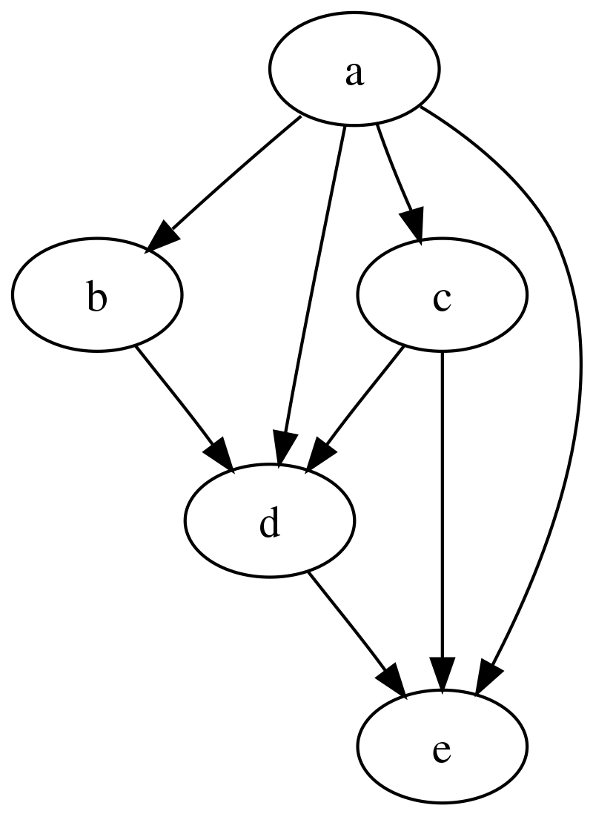

##### 如何理解"状态"

- 动态规划在具体实现时一般有以下三种要素：状态的定义，状态的转移，状态的边界。其中动态规划中的“状态”是一个抽象的概念，理解抽象的概念总是比较“虚”，所以我们将尝试把抽象的状态具体化，以实际的例子出发来加以理解。下面是几个具体的状态的定义：
  - 定义状态$f(i)表示前i个数的前缀和$
  - 定义状态$f(i, j)表示前i个数中选取j个数的方案数$
  - 定义状态$f(i, j, k)表示从节点i走到节点j最多走k步的花费最小值$
  - ...

- 我们可以将上面$f$括号里的变量看作一个个具体的状态，状态是来描述问题的、或者说刻画一个局面，一个大问题往往可以分解成几个小问题，也就是状态之间可以互相转移，那接下来我们就来谈谈状态的转移。

##### 如何理解“状态的转移”

- 状态的转移也是一种抽象的概念，我们依然从具体的例子理解
  - 在数列{$a_n$}中，$a_1$ = 3，$a_{n+1}$ = $a_n$ + $\frac{1}{n * (n + 1)}$，在这里${a_n}$和${a_{n + 1}}$的关系，就是一种转移。其中状态${a_{n + 1}}$由状态$a_n$转移而来。
  - 比如$f(0) = 0$，$f(1) = 1$, $f(x) = f(x - 1) + f(x - 2)$，状态$f(x)$由状态$f(x - 1)$和状态$f(x - 2$转移而来。
  - 比如 $f(i, j) = max(f(i - 1, j), f(i - 1, j - w(i)) + v(i)) (j >= w(i))$，状态$f(i, j)$由状态$f(i - 1, j)$和状态$f(i - 1, j - w(i))$转移而来。
  - ...
- 如果我们把状态看作图的节点，状态之间的转移看作一条有向边，那么就构成我们常说的有向无环图（DAG）。
<div align=center >
    
    <p> 图一 DAG </p>
</div>


##### 如何理解”状态的边界“

- 在数列{$a_n$}中，$a_1$ = 3，$a_{n+1}$ = $a_n$ + $\frac{1}{n * (n + 1)}$，这里$a_1$ = 3 就是边界（或者说起点）。
- 比如$f(0) = 0$，$f(1) = 1$, $f(x) = f(x - 1) + f(x - 2)$，这里$f(0) = 0$，$f(1) = 1$就是边界。
- 在上面的图一中，节点$a$就是整个DAG图的起点也就是"边界"，可以看到我们一旦知道了"起点"就可以推导出图中所有节点的值。
  - PS：状态的边界，边界可以是起点，也可以是终点。在具体实现中，我们往往更关注起点。在以后不特殊说明，都指代起点。
  - PS：状态的边界，往往对应"最小的问题"，是我们最容易解决的问题。

##### 如何理解"递归、回溯、记忆化搜索”

- 其实这三个概念"递归、回溯、记忆化搜索"是相互关联的， 我们依旧可以从上面的图一DAG图中找到对应的概念。
- 递归：如果我们要解决$问题e$，那么我们先去解决$问题d$、$问题c$、$问题a$，解决$问题d$..., 这里就是一个"递归"的处理概念，将大问题分解为一个个小问题，小问题依旧是相同的处理逻辑，直到分解为最小的问题。最小的问题，往往对应"边界"，在上图中就是$节点a$。
- 回溯：当我们处理$问题e$时，递归的先去处理$问题d$，等到$问题d$处理完后，回到$问题e$时，这就是"回溯"。
  - 记住我们递归去处理$问题d$时修改了一些变量，回溯到$问题e$时我们需要把修改的变量重新修改回它们原来的值，保持在回到$问题e$​时的状态不变。
- 记忆化搜索：图一中我们会多次处理$问题c$，$问题d$依赖它，$问题e$也依赖它。所以我们可以在第一次处理$问题c$时，将$问题c$的处理结果保存起来，下次再碰到直接返回即可，这就是"记忆"的意思。
  - 以上就是在实现动态规划时的一些理论知识，计算机学科是一门注重实践的科目，所以我们需要通过练习大量的习题加深对动态规划的理解。
  - 学习动态规划之前，我们需要确保自己已经理解"递归"了，接下来我们就先从一些简单的递归问题开始。
    - 由于计算机中**树**这种结构天然有递归的结构（如果我们把一颗有根树，节点u和其孩子节点v连一条有向边，这棵树自然就是DAG图了）所以对于初学者练习递归有很大的帮助，下面我找了一些递归练习题，帮助大家加深理解。
    - 在初学递归练习中，一定要清楚 "状态"是什么，"状态的转移"是什么，"状态的边界"是什么，最后才用代码描述出来。

##### 递归题目精讲

- 例题001：[二叉树的最大深度](https://leetcode.cn/problems/maximum-depth-of-binary-tree/)

    - 题目描述

        ```
        给定一个二叉树root，返回其最大深度。
        二叉树的最大深度是指从根节点到最远叶子节点的最长路径上的节点数。
        ```

    - 题目样例

      <div align=center >
      
      <p> 样例 </p>
      </div>

      ```
      输入：root = [3,9,20,null,null,15,7]
      输出：3
      ```

    - 题目解析

      ```
      状态的定义：从当前节点u出发，到最远叶子节点的最长路径上的节点数。
      状态的转移：当前节点u的状态，可以由其孩子节点v，转移而来。
      边界：叶子节点or空节点。
      ```

    - 代码实现

      - 如下

        ```cpp
        class Solution {
        public:
            int maxDepth(TreeNode* root) {
                if (!root) return 0;
                return std::max(maxDepth(root -> left), maxDepth(root -> right) ) + 1;
            }
        };
        ```

- 例题002：[二叉树的最小深度](https://leetcode.cn/problems/minimum-depth-of-binary-tree/)

  - 题目描述

    ```
    给定一个二叉树，找出其最小深度。最小深度是从根节点到最近叶子节点的最短路径上的节点数量。
    说明：叶子节点是指没有子节点的节点。
    ```

  - 题目样例

    <div align=center >
    
    <p> 样例 </p>
    </div>

    ```
    输入：root = [3,9,20,null,null,15,7]
    输出：2
    ```

  - 题目解析

    ```
    状态的定义：从当前节点u出发，到最近叶子节点的最短路径上的节点数量。
    状态的转移：当前节点u的状态，可以由其孩子节点v，转移而来。
    边界：叶子节点or空节点。
    ```

  - 代码实现

    - 如下

      ```cpp
      class Solution {
      public:
          int minDepth(TreeNode* root) {
              if (!root) return 0;
              int ans = 1e9;
              if (root -> left) ans = std::min(ans, minDepth(root -> left) + 1);
              if (root -> right) ans = std::min(ans, minDepth(root -> right) + 1);
              return ans == 1e9? 1: ans;
          }
      };
      ```

- 例题003：[N 叉树的最大深度](https://leetcode.cn/problems/maximum-depth-of-n-ary-tree/)

  - 题目描述

    ```
    给定一个 N 叉树，找到其最大深度。
    最大深度是指从根节点到最远叶子节点的最长路径上的节点总数。
    ```

  - 题目样例

    <div align=center >
    
    <p> 样例 </p>
    </div>

    ```
    输入：root = [1,null,2,3,4,5,null,null,6,7,null,8,null,9,10,null,null,11,null,12,null,13,null,null,14]
    输出：5
    ```

  - 题目解析
    
    ```
    状态的定义：从当前节点u出发，到最远叶子节点的最长路径上的节点数。
    状态的转移：当前节点u的状态，可以由其孩子节点v，转移而来。
  边界：叶子节点or空节点。
    ```
    
  - 代码实现

    - 如下

      ```cpp
      class Solution {
      public:
          int maxDepth(Node* root) {
              if (!root) return 0;
              int ans = 1;
              for (auto &child: root -> children) ans = std::max(ans, maxDepth(child) + 1);
              return ans;
          }
      };
      ```

- 例题004：[二叉树的前序遍历](https://leetcode.cn/problems/binary-tree-preorder-traversal/description/)

  - 题目描述

    ```
    给你二叉树的根节点root，返回它节点值的前序遍历（根-左子树-右子树）。
    ```

  - 题目样例

    <div align=center >
    
    <p> 二叉树 </p>
    </div>

    ```
    输入：root = [1,null,2,3]
    输出：[1,2,3]
    ```

  - 题目解析

    ```
    状态的定义：dfs(TreeNode* root)表示根节点root的前序遍历。
    状态的转移：当前节点u的状态，可以由其孩子节点v，转移而来。对于根节点的左孩子和右孩子形成的子树，它们依旧是原问题的一个子问题。
    递归的边界：空树我们返回空即可
    ```

  - 代码实现
    
    - 如下
      
      ```cpp
    class Solution {
      public:
        std::vector<int> ans;
          void dfs(TreeNode* root) {
              if (root == NULL) return ;
      
              ans.push_back(root -> val);    
              dfs(root -> left);
              dfs(root -> right);
        }                                              
          vector<int> preorderTraversal(TreeNode* root) {
            if (root == NULL) return {};
      
              dfs(root);
              return ans;
          }
      };
      ```

- 例题005：[N 叉树的前序遍历](https://leetcode.cn/problems/n-ary-tree-preorder-traversal/)

  - 题目描述

    ```
    给定一个n叉树的根节点root，返回其节点值的前序遍历。
    ```

  - 题目样例

    <div align=center >
    
    <p> N叉树样例 </p>
    </div>

    ```
    输入：root = [1,null,3,2,4,null,5,6]
    输出：[1,3,5,6,2,4]
    ```

  - 题目分析

    ```
    状态的定义：dfs(TreeNode* root)表示根节点root的前序遍历。
    状态的转移：当前节点u的状态，可以由其孩子节点v，转移而来。
    递归的边界：空树我们返回空即可
    ```

  - 代码实现

    - 如下

      ```cpp
      class Solution {
      public:
          std::vector<int> ans;
          void dfs(Node* root) {
              ans.push_back(root -> val);
              for (const auto &child: root -> children) dfs(child);
          }
          vector<int> preorder(Node* root) {
              if (!root) return ans;
              dfs(root);
              return ans;
          }
      };
      ```

- 例题006：[求 f(x,n)](https://www.luogu.com.cn/problem/B2147)
  - 题目描述
    - 已知 $f(x,n)=\sqrt{n+\sqrt{(n-1)+\sqrt{(n-2)+\sqrt{...+2+\sqrt{1+x}}}}}$。
    - 计算 $f$ 的值。
  - 题目样例
    ```
    输入：x = 4.2 n = 10
    输出：3.68
    ```
  - 题目解析
    ```
    上面这个等式可以看作一个"状态"，式子里的x因为没啥变化，好似常量。
    那么相等于题目给出了"状态"，我们需要找到状态之间的转移，从而把大问题拆解为一个更小的问题。
    很显然，下面的等式成立，即我们找到了一种状态之间的转移。
    ```
  - $$f(x,n)=\sqrt{n + f(x, n - 1)}$$
  - "状态的边界"：$f(x,1)=\sqrt{1+x}$，这就是"最小的问题"，为什么我们要把大问题逐渐拆解为一个个更小的问题？其中原因就在这，因为"最小的问题"我们总是很容易解决。
  - 代码实现
    - 在实现中，dfs的函数声明，就可以看作我们对"状态"的一种在代码层面的表示，函数里面的代码就是对"状态"如何转移的一种描述。
      ```cpp
      #include <bits/stdc++.h>
      using namespace std;

      float dfs(float x, float n) {
        if (n == 1) return std::sqrt(1 + x);
        return std::sqrt(n + dfs(x, n - 1));
      }

      int main() {
        ios::sync_with_stdio(false);
        cin.tie(0);
          
        float x, n;
        cin >> x >> n;
        cout << fixed << setprecision(2) << dfs(x, n) << '\n';
        return 0;
      }
      ```
  
- 例题007：[再求 f(x,n)](https://www.luogu.com.cn/problem/B2148)
  - 题目描述
    - $f(x,n)=\dfrac{x}{n+\dfrac{x}{(n-1)+\dfrac{x}{(n-2)+\dfrac{\vdots}{\cdots+\dfrac{x}{1+x}}}}}$
    - 用递归函数求解。
  - 题目样例
    ```
    输入：x = 1 n = 2
    输出：0.40
    ```
  - 题目解析
    ```
    本题和上一题基本一摸一样，同样都是给出了状态，我们需要找到状态之间的转移。
    显然下面的等式成立。
    ```
  - $$f(x,n)=\dfrac{x}{n+f(x,n-1)}$$
  - 状态的边界：$f(x,1)=\dfrac{x}{1+x}$
  - 代码实现
    - 代码如下
      ```cpp
      #include <bits/stdc++.h>
      using namespace std;

      float dfs(float x, float n) {
        if (n == 1) return x / (1 + x);
        return x / (n + dfs(x, n - 1));
      }

      int main() {
        ios::sync_with_stdio(false);
        cin.tie(0);
          
        float x, n;
        cin >> x >> n;
        cout << fixed << setprecision(2) << dfs(x, n) << '\n';
        return 0;
      }
      ```
  
- 例题008：[子集](https://leetcode.cn/problems/subsets/)

  - 题目描述

    ```
    给你一个整数数组nums，数组中的元素互不相同，返回该数组所有可能的子集。
    1<= nums.length <= 10
    ```

  - 题目样例

    ```
    输入：nums = [1,2,3]
    输出：[[],[1],[2],[1,2],[3],[1,3],[2,3],[1,2,3]]
    ```

  - 题目解析

    ```
    状态的定义：前i个数里已经选了哪些数（还没选择第i个数）。
    状态的转移：下一个数即第i个数选 or 不选。
    递归的边界：已经考虑完所有数的时候。
    ```

  - 代码实现
    
    - 如下
      
      ```cpp
      class Solution {
    public:
          vector<vector<int>> ans;
          void dfs(int i, vector<int> v, const vector<int>& nums) {
              if (i == nums.size()) {
                  ans.push_back(v);
                  return ;
              }
              // 不选第i个数
              dfs(i + 1, v, nums);
              // 选第i个数
              v.push_back(nums[i]);
              dfs(i + 1, v, nums);
          }
          vector<vector<int>> subsets(vector<int>& nums) {
              vector<int> v;
              dfs(0, v, nums);
              return ans;
          }
      };
  ```
  
- 例题009：[子集 II](https://leetcode.cn/problems/subsets-ii/)

  - 题目描述

    ```
    给你一个整数数组nums，其中可能包含重复元素，请你返回该数组所有可能的子集。
    1 <= nums.length <= 10
    ```

  - 题目样例

    ```
    输入：nums = [1,2,2]
    输出：[[],[1],[1,2],[1,2,2],[2],[2,2]]
    ```

  - 题目解析

    ```
    本题和上一题唯一的区别就是含有重复的元素，不过本质和上一题没啥太大区别（举一反三的能力）。
    上一题由于每个元素都不重复，即每个元素要么选0个，要么选1个。
    这一题由于有重复，即每个元素要么选0个，要么选1个，要么选2个，要么选3个，依次类推。
    
    状态的定义：前i个数里已经选了哪些数（还没选择第i个数）。
    状态的转移：下一个数即第i个数一次性选多少个。
    递归的边界：已经考虑完所有数的时候。
    ```

  - 代码实现

    - 如下，当然你把这份代码提交到上一题依旧是可以过上一题的

    - 代码里有STL map, 迭代器iterator，自动类型推导auto的语法，如果不熟悉，借机学习下

      ```cpp
      class Solution {
      public:
          using MAP = std::map<int, int>;
          // <元素, 个数>
          MAP mp;
          vector<vector<int>> ans;
          void dfs(MAP::iterator it, vector<int> v) {
              if (it == mp.end()) {
                  ans.push_back(v);
                  return ;
              }
              // cnt 表示当前元素选几个
              for (int cnt = 0; cnt <= it -> second; ++cnt) {
                  auto newv = v;
                  auto newit = it;
                  for (int i = 0; i < cnt; ++i) {
                      newv.push_back(it -> first);
                  }
                  dfs(++newit, newv);
              }
          }
          vector<vector<int>> subsetsWithDup(vector<int>& nums) {
              for (auto &num: nums) mp[num] += 1;
              vector<int> v;
              dfs(mp.begin(), v);
              return ans;
          }
      };
      ```

- 例题010：[组合总和](https://leetcode.cn/problems/combination-sum/)

  - 题目描述

    ```
    给定一个候选人编号的无重复元素集合candidates和一个目标数target，找出candidates中所有可以使数字和为target的组合。
    candidates中的每个数字在每个组合中可以使用无限次。
    ```

  - 题目样例

    ```
    输入：candidates = [2,3,6,7], target = 7
    输出：[[2,2,3],[7]]
    解释：
    2 和 3 可以形成一组候选，2 + 2 + 3 = 7 。注意 2 可以使用多次。
    7 也是一个候选， 7 = 7 。
    仅有这两种组合。
    ```

  - 题目解析

    ```
    状态的定义：前i个数里，已经选了哪些数（不包含第i个数），这些数的和为多少。
    状态的转移：考虑第i个数选多少次。
    递归的边界：已经考虑完所有数的时候。
    ```

  - 代码实现

    - 如下

      ```cpp
      class Solution {
      public:
          vector<vector<int>> ans;
          void dfs(int i, vector<int> v, int sum, const vector<int>& candidates, const int &target) {
              // 递归的边界
              if (i == candidates.size()) {
                  if (sum == target) ans.push_back(v);
                  return ;
              }
              // 枚举第i个数选几个
              for (int cnt = 0; ; ++cnt) {
                  if (sum + cnt * candidates[i] > target) break;
                  vector<int> newv = v;
                  for (int k = 0; k < cnt; ++k) newv.push_back(candidates[i]);
                  dfs(i + 1, newv, sum + cnt * candidates[i], candidates, target);
              }
          }
          vector<vector<int>> combinationSum(vector<int>& candidates, int target) {
              vector<int> v;
              dfs(0, v, 0, candidates, target);
              return ans;
          }
      };
      ```

- 例题011：[组合总和 II](https://leetcode.cn/problems/combination-sum-ii/)

  - 题目描述

    ```
    给定一个候选人编号的集合candidates和一个目标数target，找出candidates中所有可以使数字和为target的组合。
    candidates中的每个数字在每个组合中只能使用一次，注意candidates中有相同的数。
    1 <= candidates.length <= 100
    1 <= candidates[i] <= 50
    ```

  - 题目样例

    ```
    输入: candidates = [10,1,2,7,6,1,5], target = 8,
    输出:
    [
    [1,1,6],
    [1,2,5],
    [1,7],
    [2,6]
    ]
    ```

  - 题目解析

    - 状态的定义：前i个数里已经选了哪些数（不包含第i个数），这些数的和为多少。
      状态的转移：考虑第i个数选多少次。
      递归的边界：已经考虑完所有数的时候。

  - 代码实现

    - 如下

    - 考虑前i个数的时候，是a数组里的前i个数哟，并非candidates

      ```cpp
      class Solution {
      public:
          static const int N = 50 + 5;
          vector<vector<int>> ans;
          // 记录每个数出现的个数, <值，个数>
          int a[N];
          void dfs(int i, vector<int> v, int sum, const int &target) {
              if (i >= N) {
                  if (sum == target) ans.push_back(v);
                  return ;
              }
              // 枚举第i个数选了多少个
              for (int cnt = 0; cnt <= a[i]; ++cnt) {
                  if (sum + cnt * i > target) break;
                  vector<int> newv = v;
                  for (int k = 0; k < cnt; ++k) newv.push_back(i);
                  dfs(i + 1, newv, sum + cnt * i, target);
              }
          }
          vector<vector<int>> combinationSum2(vector<int>& candidates, int target) {
              for (auto &c: candidates) a[c] += 1;
              vector<int> v;
              dfs(0, v, 0, target);
              return ans;
          }
      };
      ```

- 例题012：[组合总和 III](https://leetcode.cn/problems/combination-sum-iii/)

  - 题目描述

    ```
    找出所有相加之和为n的k个数的组合，且满足下列条件：
      - 只使用数字1到9
      - 每个数字最多使用一次 
    返回所有可能的有效组合的列表。
    ```

  - 题目样例

    ```
    输入: k = 3, n = 7
    输出: [[1,2,4]]
    解释:
    1 + 2 + 4 = 7
    没有其他符合的组合了。
    ```

  - 题目解析

    ```
    状态的定义：使用了那些数字（递增排序），其和为多少
    状态的转移：枚举使用下一个数字，且比上一个数字大
    边界：所有数字都考虑完了
    ```

  - 代码实现

    - 如下

      ```cpp
      class Solution {
      public:
          vector<vector<int>> ans;
          void dfs(vector<int> v, int sum, const int &k, const int &n) {
              // 剪枝
              if (v.size() > k || sum > n) return ;
              // 递归的边界
              if (v.size() == k && sum == n) {
                  ans.push_back(v);
                  return ;
              }
              // 枚举使用下一个数, v里的数字严格递增存放
              for (int num = v.back() + 1; num <= 9; ++num) {
                  auto newv = v;
                  newv.push_back(num);
                  dfs(newv, sum + num, k, n);
              }
          }
          vector<vector<int>> combinationSum3(int k, int n) {
              for (int num = 1; num <= 9; ++num) {
                  vector<int> v = {num};
                  dfs(v, num, k, n);
              }
              return ans;
          }
      };
      ```

- 例题013：[组合](https://leetcode.cn/problems/combinations/)

  - 题目描述

    ```
    给定两个整数n和k，返回范围[1, n]中所有可能的k个数的组合。
    你可以按任何顺序返回答案。
    ```

  - 题目样例

    ```
    输入：n = 4, k = 2
    输出：
    [
      [2,4],
      [3,4],
      [2,3],
      [1,2],
      [1,3],
      [1,4],
    ]
    ```

  - 题目解析

    ```
    状态的定义：使用了那些数字（递增排序）
    状态的转移：枚举使用下一个数字，且比上一个数字大
    边界：所有数字都考虑完了
    ```

  - 代码实现

    - 如下

      ```cpp
      class Solution {
      public:
          vector<vector<int>> ans;
          void dfs(vector<int> v, const int &n, const int &k) {
              if (v.size() > k) return ;
              if (v.size() == k) ans.push_back(v);
              for (int num = v.back() + 1; num <= n; ++num) {
                  auto newv = v;
                  newv.push_back(num);
                  dfs(newv, n, k);
              }
          }
          vector<vector<int>> combine(int n, int k) {
              for (int num = 1; num <= n; ++num) {
                  vector<int> v = {num};
                  dfs(v, n, k);
              }
              return ans;
          }
      };
      ```

- 例题014：[全排列](https://leetcode.cn/problems/permutations/)
  
  - 题目描述
  
- 例题015：[二叉树的所有路径](https://leetcode.cn/problems/binary-tree-paths/description/)
  
  - 题目描述
    ```
    给你一个二叉树的根节点root，按任意顺序，返回所有从根节点到叶子节点的路径。
    ```
  
- 题目样例
  
    - <div align=center >
          
          <p>  </p>
        </div>
    
    - 输入：root = [1,2,3,null,5]
  - 输出：["1->2->5","1->3"]
  
- 题目解析
  
    - 容易知道，对于**树**上的任意两个节点u，v ，它们之间的路径是唯一的。
  - 本题我们总是从根节点到其他节点，所以在定义状态时没必要对根节点增加一维。所以我们可以这样定义状态，定义状态**dfs(TreeNode* cur)**表示从根节点到当前节点的路径（并不包含当前节点的值）。
  
- 代码实现
  
  - 在下面的实现中，cur和path，一起构成状态。表示当前在cur节点，根节点到cur节点的路径为path（并不包含cur节点的值）。
  
  - 拿上面的样例，举个例子，比如当前cur在节点5，那么此时path保存的节点为{1, 2}而不是{1, 2, 5}，当前节点5并没有保存在path里。
  
  - 有了状态，接下来是转移，转移显然就是递归的去跑当前节点的左右孩子节点。当其左右孩子节点都跑完后，我们需要"还原现场"，也即大家口中的"回溯"。既然要"还原现场"，那么我们肯定得知道原来的现场是什么，就是还没进入dfs函数内部的状态，那就是cur和path。在dfs函数内部我们对path做了修改，path.push_back()，所以还原就是path.pop_back()。
  
  - 在这里，可能很多初学者会疑惑，我们dfs(cur -> left)，dfs(cur -> right)也修改了path呀。其实这还不是不理解"递归"的表现，当dfs(cur -> left)函数执行完后，它也会还原当初进入dfs(cur -> left)时的状态，dfs(cur -> right)同理，所以当下面的代码dfs(cur -> left)和dfs(cur -> right)执行完后，唯一对path做了修改的就只是前面操作的path.push_back()，所以我们最后path.pop_back()也就还原了。
  
  - 多说一句，对于绝大多数初学者，"递归"，"回溯"基本上就是学习路上最大的拦路虎，有的初学者要花费几周甚至几个月才能理解其中的奥秘。希望大家好好理解，相信你也能够理解计算机中"递归"的美。
  
      ```cpp
      class Solution {
      public:
          vector<string> path, ans;
          void dfs(TreeNode* cur) {
              if (cur == nullptr) return;
              path.push_back(std::to_string(cur -> val));
              if (cur -> left == nullptr && cur -> right == nullptr) {
                  string t;
                  for (int i = 0, len = path.size(); i < len; ++i) {
                      if (i == 0) t += path[i];
                      else t += "->" + path[i]; 
                  }
                  ans.push_back(t);
              }
              dfs(cur -> left);
              dfs(cur -> right);
              path.pop_back();
          }
          vector<string> binaryTreePaths(TreeNode* root) {
              dfs(root);
              return ans;
          }
      };
    ```
  
- 这一行始终保留，不要删除
