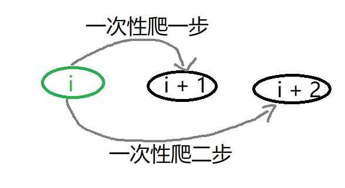
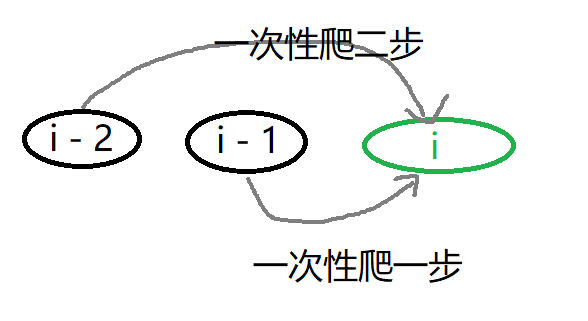
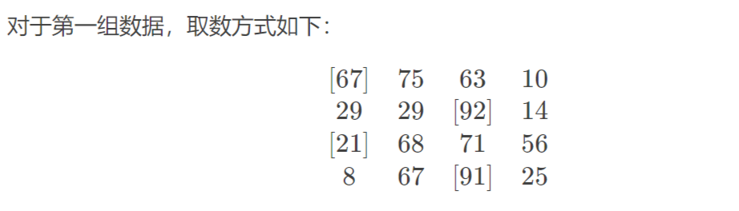
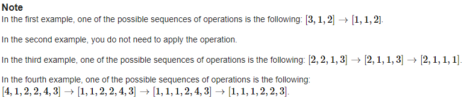
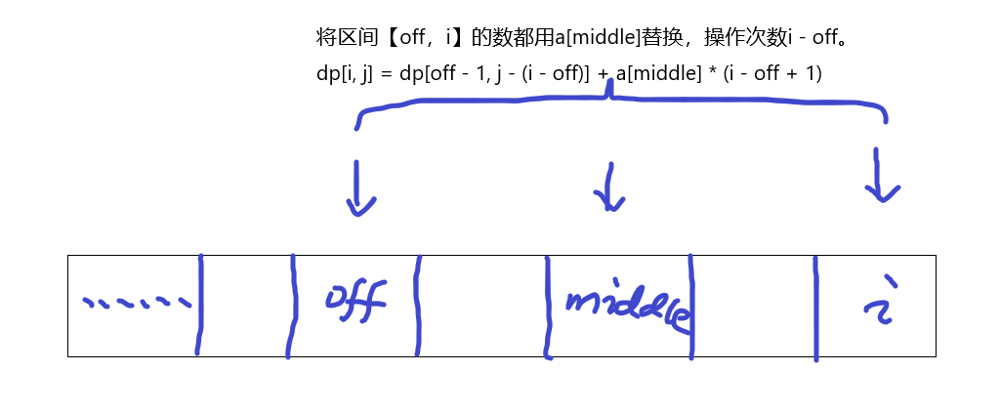

<div align=center >
  <font face="黑体" size=7>动态规划的思考艺术（第二卷）</font>
 </div>

##### 写在前面的话

- 经过第一卷的学习，我们应该已经比较熟悉递归、回溯，现在我们开始接触动态规划。当然，依旧是从简单的、经典的，一些问题入手。
- 动态规划为何常常是算法竞赛的宠儿？可能的一个原因在于，动态规划的问题需要选手在（复杂的）给定题目的描述中，抽象出合理的状态以及高效的状态转移，这表达了选手高超的分析和建模的能力。（动态规划的思想：从复杂的题目背景中抽象出状态表示，然后设计它们之间的转移）
- 状态如果以更加广义的方式理解，其实不仅仅出现在DP里，如贪心时要维护的信息，$bfs$寻找最短路时的状态，滑动窗口维护[L, R)信息时的状态等等，广泛的我们可以把**需要维护的信息**都可以叫状态，状态是我们对问题的抽象表达，维护相关的信息/状态就可以顺利的解决问题了。

##### DP题目精讲

- 例题B_001：[爬楼梯](https://leetcode.cn/problems/climbing-stairs/description/)

  - 题目描述

    ```
    假设你正在爬楼梯。需要n阶你才能到达楼顶。每次你可以爬1或2个台阶。你有多少种不同的方法可以爬到楼顶呢？
    ```

  - 题目样例

    ```
    输入：n = 2
    输出：2
    解释：有两种方法可以爬到楼顶。
    1. 1 阶 + 1 阶
    2. 2 阶
    ```

  - 题目解析

    ```
    状态的定义：我们定义f(i)表示爬到第i阶台阶的方案数
    状态的转移：
       f(i - 1) + 再一次性爬一个台阶，就爬到了第i阶台阶
       f(i - 2) + 再一次性爬二个台阶，就爬到了第i阶台阶
       f(i - 3) + 再一次性爬三个台阶，就爬到了第i阶台阶，但是题目规定"每次你可以爬 1 或 2 个台阶"，所以这种不行。
    状态的边界：f(1) = 1, f(2) = 2
    ```

    - 状态的转移：$f(i) = f(i - 1) + f(i - 2)$
    - 状态的边界：$f(1) = 1, f(2) = 2$
    - 时间复杂度：$O(N)$
  - 在递推法实现时，状态的边界往往就是最开始需要初始化的一些状态；而在记忆化搜索时，状态的边界往往是最后递归到才赋值。
  
- 代码实现

  - 在动态规划递推法的实现中大概分了两种，一种可以叫做**人人为我**，另一种叫做**我为人人**, 当然都叫做递推法。

  - 我为人人：表示根据$状态i$，可以转移到那些状态去。

    - 一般来说，$状态i$已经确定

  - 人人为我：表示$状态i$，可以由哪些其他状态转移而来。

    - 一般来说，由哪些状态转移而来的这些状态都已确定。这也是一个常见的DP优化技巧，由于这些要转移而来的状态都已确定，常常可以利用一些数据结构优化转移的时间复杂度，从而降低整体的时间复杂度。

    - 哦对了，我们一直没有讲DP的时间复杂度，DP的时间复杂度一般可归纳为：$O(T) = O(状态数) * O(转移数)$，还记得我们第一卷讲的DAG图吗？所有的动态规划，都可以抽象为一张DAG图，状态数就对应图上所有的节点数目，转移数就对应单个节点的出边，所以DP的时间复杂度也等于$O(V + E), V为DAG图上的节点数，E为DAG图上的边数，且每个节点，每条边都只访问一次$

    - 在多数情况下，递推法的时间复杂度是：$状态总数×每个状态的决策个数×决策时间$。如果不同状态的决策个数不同，需具体问题具体分析。

    - <div align=center >
      
      <p> 我为人人 示例图 </p>
    </div>
      
    - <div align=center >
    
        <p> 人人为我 示例图 </p>
        </div>

  - 这两种方法本质是一样的，只是在代码实现层面，有的题目适合**人人为我**写法，有的题目适合**我为人人**写法，当然大多数题目两种写法都可。

  - 下面就以本题目，展示两种写法，加深大家对不同实现的理解。

    ```cpp
    // "人人为我" 写法
    class Solution {
    public:
      static const int N = 45 + 5;
      int dp[N];
      int climbStairs(int n) {
          dp[1] = 1;
          dp[2] = 2;
          for (int i = 3; i <= n; ++i) {
              dp[i] = dp[i - 1] + dp[i - 2];
          }
          return dp[n];
      }
    };
    ```

    ```cpp
    // "我为人人" 写法
    // 状态i 一次性爬一步就到了状态i + 1, 一次性爬二步就到了状态i + 1
    class Solution {
    public:
      static const int N = 45 + 5;
      int dp[N];
      int climbStairs(int n) {
          dp[1] = 1;
          dp[2] = 1;
          for (int i = 1; i <= n; ++i) {
              dp[i + 1] += dp[i];
              dp[i + 2] += dp[i];
          }
          return dp[n];
      }
    };
    ```

  - 在**人人为我**的写法中，$状态i$只与$状态i - 1$和$状态i - 2$有关，所以我们并不需要存放$状态i - 3, i - 4$,..., 这样可以节约大量的内存，只需少量几个变量即可，这就是我们常说的**滚动数组**优化。

      ```cpp
      // "人人为我"的"滚动数组"优化
      class Solution {
      public:
        int climbStairs(int n) {
            if (n == 1) return 1;
            if (n == 2) return 2;
            int i1 = 1, i2 = 2, curi;
            for (int i = 3; i <= n; ++i) {
                curi = i1 + i2;
                i1 = i2;
                i2 = curi;
            }
            return curi;
        }
      };
    ```

  - 上面我们使用的都是动态规划里递推的方法，本题的一个递归方法实现如下

      ```cpp
      class Solution {
      public:
        int climbStairs(int n) {
            if (n == 1) return 1;
            if (n == 2) return 2;
            return climbStairs(n - 1) + climbStairs(n - 2);
        } 
      };
    ```

  - 如果我们把处理过的记录下来，便是记忆化了，本题的一个**记忆化搜索**的实现如下

      ```cpp
      class Solution {
      public:
        static const int N = 45 + 5;
        int dp[N];
        int climbStairs(int n) {
            if (n == 1) return 1;
            if (n == 2) return 2;
            if (dp[n] != 0) return dp[n];
            return dp[n] = climbStairs(n - 1) + climbStairs(n - 2);
        }
      };
    ```

  - 至此，我们通过[爬楼梯](https://leetcode.cn/problems/climbing-stairs/description/)这道例题，讲解了大量的概念，和与之对应的代码实现。希望能更好的帮助初学者。当然基于"人人为我"的递推式，还可以把递推式变形成"矩阵快速幂"，但这已不属于初学者的范畴，不过在后面的"动态规划的优化"的相关章节会陆续讲解这类比较套路的DP优化。

- 例题B_002：[数字三角形 Number Triangles](https://www.luogu.com.cn/problem/P1216)

  - 题目描述

    ```
    观察下面的数字金字塔。写一个程序来查找从最高点到底部任意处结束的路径，使路径经过数字的和最大。每一步可以走到左下方的点也可以到达右下方的点。
    在下面的样例中，从7->3->8->7->5的路径产生了最大权值。
    ```

    <div align=center >
        
        <p> 数字三角形 </p>
    </div>

  - 题目样例

    ```
    // 输入
    第一个行一个正整数r，表示行的数目。
    后面每行为这个数字金字塔特定行包含的整数。
    5
    7
    3 8
    8 1 0
    2 7 4 4
    4 5 2 6 5
    // 输出
    单独的一行,包含那个可能得到的最大的和
    30
    ```

  - 题目解析一

    ```
    状态的定义：f(i, j)表示从顶部出发，走到坐标(i, j)时能获得的最大值
    状态的转移：从当前坐标(i, j)，要么走向左下方，要么走向右下方
    状态的边界：走到数字三角形的边界
    ```

    - 状态的转移
      -  如下，**我为人人**形式的递推
      - $f(i, \ j) \begin{cases} \rightarrow f(i + 1, \ j)，往左下方走\\ \rightarrow f(i + 1, \ j + 1)，往右下方走\end{cases}$
    - 状态的边界
      - $f(1, \ 1) = a[1][1]$
    - 时间复杂度
      - $O(N ^ 2)$
    - 在递推法实现中，状态的边界就是对应状态的初始化，以后不在说明

  - 代码实现

    - 如下，我为人人的递推写法

      ```cpp
      #include <bits/stdc++.h>
      using namespace std;
      
      const int N = 1e3 + 5;
      int r, a[N][N], dp[N][N], ans = 0;
      
      int main() {
        cin >> r;
        for (int i = 1; i <= r; ++i)
          for (int j = 1; j <= i; ++j)
            cin >> a[i][j];
            
        dp[1][1] = a[1][1];
        for (int i = 1; i <= r - 1; ++i) {
          for (int j = 1; j <= i; ++j) {
            dp[i + 1][j] = std::max(dp[i + 1][j], dp[i][j] + a[i + 1][j]);
            dp[i + 1][j + 1] = std::max(dp[i + 1][j + 1], dp[i][j] + a[i + 1][j + 1]);
          }
        }
        for (int j = 1; j <= r; ++j) ans = std::max(ans, dp[r][j]);
        cout << ans << "\n";
        return 0;
      }
      ```

  - 题目解析二

    - 这是第二种写法，状态的定义不变，但是转移形式有所变化
    - 状态的转移
      - 如下，**人人为我**形式的递推
      - $f(i, \ j) \begin{cases} \leftarrow f(i - 1, \ j - 1) \ + \ a[i][j]，从左上方而来\\ \leftarrow f(i - 1, \ j) \ + \ a[i][j]，从右上方而来\end{cases}$
    - 状态的边界
          - $f(1, \ 1) = a[1][1]$
    
  - 代码实现

    - 如下，人人为我的递推写法, 由于$f(i, ...)只由f(i - 1, ...)转移而来，所以可以滚动数组优化$，见下面的实现

      ```cpp
      // 人人为我，无滚动数组优化
      #include <bits/stdc++.h>
      using namespace std;
      
      const int N = 1e3 + 5;
      int r, a[N][N], dp[N][N], ans = 0;
      
      int main() {
        cin >> r;
        for (int i = 1; i <= r; ++i)
          for (int j = 1; j <= i; ++j)
            cin >> a[i][j];
            
        dp[1][1] = a[1][1];
        for (int i = 1; i <= r; ++i) {
          for (int j = 1; j <= i; ++j) {
            dp[i][j] = std::max({dp[i - 1][j] + a[i][j], dp[i - 1][j - 1] + a[i][j]});
          }
        }
        for (int j = 1; j <= r; ++j) ans = std::max(ans, dp[r][j]);
        cout << ans << "\n";
        return 0;
      }
      ```
      
       ```cpp
      // 人人为我，滚动数组优化，注意dp数组第一维的大小是2，状态里全部加上"&"就可以简单的实现滚动数组优化了，这也是如何改写为滚动数组优化的技巧.
      #include <bits/stdc++.h>
      using namespace std;
      
      const int N = 1e3 + 5;
      int r, a[N][N], dp[2][N], ans = 0;
      
      int main() {
        cin >> r;
        for (int i = 1; i <= r; ++i)
          for (int j = 1; j <= i; ++j)
            cin >> a[i][j];
            
        dp[1 & 1][1] = a[1][1];
        for (int i = 1; i <= r; ++i) {
          for (int j = 1; j <= i; ++j) {
            dp[i & 1][j] = std::max({dp[i - 1 & 1][j] + a[i][j], dp[i - 1 & 1][j - 1] + a[i][j]});
          }
        }
        for (int j = 1; j <= r; ++j) ans = std::max(ans, dp[r & 1][j]);
        cout << ans << "\n";
        return 0;
      }
       ```
    
  - 题目解析三
  
      - 我们知道所有的动态规划都可以抽象成一个有向无环图（即DAG图），有时这个DAG图是显式的，有时是隐式的。
      - **DAG模型**：DAG图上的动态规划如计算最长路、最短路或路径计数问题，由于DAG最长（短）路的特殊性，有两种“对称”的状态定义方式。
        - 状态一：$设f(X)表示从状态X出发的最长路（最短路、方案数...）$，转移时考虑状态X能转移到哪些状态，刷表法（也就是递推法里的我为人人）
        - 状态二：$设f(X)表示以状态X结束的最长路（最短路、方案数...）$，转移时考虑状态X由哪些状态转移而来，填表法（也就是递推法里的人人为我）
        - 状态的定义里一个是起点，一个是终点。
  
  - 代码实现
  
    - DAG模型常常用记忆化搜索的方式实现，由于加了记忆化每个状态节点只会被计算一次，所以时间复杂度也为$O(N ^ 2)$
  
    - 状态的定义：$f(i, \ j)表示以位置(i, \ j)出发能获得的最大路径和$
  
    - 状态的转移：$f(i, \ j) \begin{cases} \rightarrow f(i + 1, \ j)，往左下方走\\ \rightarrow f(i + 1, \ j + 1)，往右下方走\end{cases}$
  
      ```cpp
      #include <bits/stdc++.h>
      using namespace std;
      
      const int N = 1e3 + 5;
      int r, a[N][N], dp[N][N], ans = 0;
      
      // dp[i][j]表示从位置(i, j)出发能获得的最大路径和
      int dfs(int i, int j) {
        if (i == r + 1) return 0;
        if (dp[i][j] != -1) return dp[i][j];
        return dp[i][j] = std::max({dfs(i + 1, j) + a[i][j], dfs(i + 1, j + 1) + a[i][j]});
      }
      
      int main() {
        cin >> r;
        for (int i = 1; i <= r; ++i)
          for (int j = 1; j <= i; ++j)
            cin >> a[i][j];
        
        std::memset(dp, -1, sizeof dp);
        cout << dfs(1, 1) << "\n";
        return 0;
      }
      ```
  
    - 状态的定义：$f(i, \ j)表示以位置(i, \ j)结束能获得的最大路径和$
  
    - 状态的转移：$f(i, \ j) \begin{cases} \leftarrow f(i - 1, \ j - 1) \ + \ a[i][j]，从左上方而来\\ \leftarrow f(i - 1, \ j) \ + \ a[i][j]，从右上方而来\end{cases}$

      ```cpp
      #include <bits/stdc++.h>
      using namespace std;
      
      const int N = 1e3 + 5;
      int r, a[N][N], dp[N][N], ans = 0;
      
      // dp[i][j]表示以位置(i, j)结束能获得的最大路径和
      int dfs(int i, int j) {
        if (i == 0) return 0;
        if (dp[i][j] != -1) return dp[i][j];
        return dp[i][j] = std::max({dfs(i - 1, j - 1) + a[i][j], dfs(i - 1, j) + a[i][j]});
      }
      
      int main() {
        cin >> r;
        for (int i = 1; i <= r; ++i)
          for (int j = 1; j <= i; ++j)
            cin >> a[i][j];
        
        std::memset(dp, -1, sizeof dp);
        for (int j = 1; j <= r; ++j) ans = std::max(ans, dfs(r, j));
        cout << ans << "\n";
        return 0;
      }
      ```
  
  - 总结一下：
    - 状态的定义一：$f(i, \ j)表示以位置(i, \ j)出发能获得的最大路径和$，基于这个状态的定义，有递推法和记忆化搜索两种实现方式
    - 状态的定义二：$f(i, \ j)表示以位置(i, \ j)结束能获得的最大路径和$，基于这个状态的定义，有递推法和记忆化搜索两种实现方式
    - 所以上面一共实现了四份代码（除去滚动数组优化的实现），希望大家好好理解。对于这四种实现虽然本质都相同，但是在一些时间复杂度要求更高的题目中，**人人为我**的递推实现中，常常可以优化转移的时间，如**前缀和优化DP、线段树优化DP...**，为啥可以优化转移呢？因为在**人人为我**的DP实现中哪些要依赖的状态都已经计算好了，所以我们可以对已计算好的状态利用一些数据结构等技巧优化转移。
    - 对于后面要讲的DP问题，在时间复杂度可以通过题目的情况下，我就只实现其中一种了，由于个人偏好我常常用记忆化搜索的方式实现。

- 例题B_003：[最长上升子序列 LIS](https://www.luogu.com.cn/problem/AT_chokudai_S001_h)

  - 题目描述

    ```
    给定一个长为n的序列ai，求这个序列的最长单调上升子序列长度。N <= 1e5
    ```

  - 题目样例

    ```
    // 输入
    5
    3 1 5 4 2
    
    // 输出
    2
    ```

  - 题目解析

    - 先给出经典的$O(N ^ 2)$的做法
    - 状态的定义：$f(i)表示前i个元素[1: i], 以第i个元素结尾时，最长单调上升子序列长度$
    - 状态的转移：$f(i) = max\{ f(j) + 1 \}, 且\ a[j] \ < \ a[i]$
    - 状态的边界：$f(i) = 1, 只有自己一个元素$
    - 时间复杂度：$状态数为O(N), 转移要O(N), 所以总的时间复杂度为O(N ^ 2)$

  - 代码实现

    - 如下，由于本题数据范围过大，$O(N^2)$的做法并不能通过，可以去这提交[最长递增子序列](https://leetcode.cn/problems/longest-increasing-subsequence/)，参考代码here：[longest-increasing-subsequence.cpp](https://github.com/OFShare/DP-Book/blob/master/codes/longest-increasing-subsequence.cpp)

      ```cpp
      #include <bits/stdc++.h>
      using namespace std;
      
      const int N = 5e3 + 5;
      int n, a[N], dp[N], ans = 1;
      
      int main() {
        cin >> n;
        for (int i = 1; i <= n; ++i) cin >> a[i];
        
        for (int i = 1; i <= n; ++i) {
          dp[i] = 1;
          for (int j = 1; j < i; ++j) {
            if (a[j] < a[i]) {
              dp[i] = std::max(dp[i], dp[j] + 1);
            }
          }
          ans = std::max(ans, dp[i]);
        }
        cout << ans << "\n";
        return 0;
      }
      ```

  - 题目解析二

    - 本题存在一个经典的贪心 + 二分做法
    - 状态的定义：$f(i)表示从左往右扫描数组时，最长递增子序列长度为i时，这个子序列结尾的最小值$
    - 由于这里结尾保存的最小值，体现了贪心的思想
    - 由于是从左往右扫描，当扫描到$a[i]$时，如何快速插入$a[i]$到合适位置用到了二分，因为按照上面的状态的定义，长度为3的子序列的结尾的值，肯定小于长度为4的子序列的结尾的值，即长度越大值越大，所以可以二分。

  - 代码实现

    - 如下，时间复杂度$O(N * logN)$，下面的实现中$dp$数组下标是从0开始的，所以$dp[i]$保存的长度就是$i + 1$

      ```cpp
      #include <bits/stdc++.h>
      using namespace std;
      
      // dp[i]表示从左往右扫描数组时，最长递增子序列长度为i+1时，这个子序列结尾的最小值
      vector<int> dp;
      int n, x;
      
      int main() {
        cin >> n;
        for (int i = 1; i <= n; ++i) {
          cin >> x;
          auto it = std::lower_bound(dp.begin(), dp.end(), x);
          
          if (it == dp.end()) dp.push_back(x);
          else *it = x;
        }
        cout << dp.size() << "\n";
        return 0;
      }
      ```
  
- 例题B_004：[最长公共子序列 LCS](https://www.luogu.com.cn/problem/P1439)

  - 题目描述

    ```
    给出1,2,...,n的两个排列P1和P2，求它们的最长公共子序列。N <= 1e5
    ```

  - 题目样例

    ```
    // 输入
    5 
    3 2 1 4 5
    1 2 3 4 5
    
    // 输出
    3
    ```

  - 题目解析

    - 先给出经典的$O(N ^ 2)$的做法
    - 状态的定义：$f(i, \ j)表示排列P1的前i个元素，排列P2的前j个元素，它们的最长的公共子序列的长度$
    - 状态的转移：$f(i, \ j) \begin{cases} \leftarrow f(i - 1, \ j - 1) \ + \ 1，\ \ P1[i] \ = P2[j] \\ \\ \leftarrow max\{ f(i - 1, \ j), f(i, j - 1) \} \ + \ 0，\ \ P1[i] \ != P2[j] \end{cases}$
    - 状态的边界：$f(0, \ j) = 0, f(i, \ 0) = 0$

  - 代码实现

    - 如下，本题范围是$1e5$，所以$O(N^2)$的做法会超时，可以去这提交数据范围更小的题[最长公共子序列](https://leetcode.cn/problems/longest-common-subsequence/)，参考代码here：[longest-common-subsequence.cpp](https://github.com/OFShare/DP-Book/blob/master/codes/longest-common-subsequence.cpp)

    - 在记忆化搜索的实现中，未访问过的状态一般初始化为-1，也就是代码里的$std::memset(dp, -1, sizeof\ \ dp)$这行
    
      ```cpp
    // 记忆化搜索实现，时间复杂度O(N ^ 2)
      #include <bits/stdc++.h>
    using namespace std;
      
      const int N = 1e3 + 5;
      int n, P1[N], P2[N], dp[N][N];
      
      // dp[i][j]：表示排列P1的前i个元素，排列P2的前j个元素，它们的最长的公共子序列的长度
      int dfs(int i, int j) {
        if (i == 0 || j == 0) return 0;
        if (dp[i][j] != -1) return dp[i][j];
        int ret = 0;
        if (P1[i] == P2[j]) ret = std::max(ret, dfs(i - 1, j - 1) + 1);
        return dp[i][j] = std::max({ret, dfs(i - 1, j), dfs(i, j - 1)});
      }
      
      int main() {
        cin >> n;
        for (int i = 1; i <= n; ++i) cin >> P1[i];
        for (int i = 1; i <= n; ++i) cin >> P2[i];
        
        std::memset(dp, -1, sizeof dp);
        cout << dfs(n, n) << "\n";
        return 0;
      }
      ```
      

  - 题目解析二
    
    - 巧妙的转化，将排列等价映射，转化成$LIS$问题
    
      ```
      A:3 2 1 4 5
      B:1 2 3 4 5
      
      我们不妨给它们重新标个号：把3标成a,把2标成b，把1标成c……于是变成：
      
      A: a b c d e
      B: c b a d e
      
      这样标号之后，LCS长度显然不会改变。但是出现了一个性质：
      
      两个序列的子序列，一定是A的子序列。而A本身就是单调递增的。
      因此这个子序列是单调递增的。
      
      换句话说，只要这个子序列在B中单调递增，它就是A的子序列。
      
      哪个最长呢？当然是B的LIS最长。
      
      自此完成转化。
      ```
  
  - 代码实现二
  
    - 等价映射转化为$LIS$问题，而$LIS$问题可以做到$O(N * logN)$
  
      ```cpp
      #include <bits/stdc++.h>
      using namespace std;
      
      const int N = 1e5 + 5;
      int mp[N], n, x;
      
      int LIS(const vector<int> &v) {
        vector<int> dp;
        for (auto &c: v) {
          auto it = lower_bound(dp.begin(), dp.end(), c);
          if (it == dp.end()) dp.push_back(c);
          else *it = c;
        }
        return dp.size();
      }
      
      int main() {  
        cin >> n;
        for (int i = 1; i <= n; ++i) {
          cin >> x;
          mp[x] = i;
        }
        vector<int> v;
        for (int i = 1; i <= n; ++i) {
          cin >> x;
          v.push_back(mp[x]);
        }
        cout << LIS(v);
        return 0;
      }
      ```

- 例题B_005：[编辑距离](https://www.luogu.com.cn/problem/P2758)

  - 题目描述

    ```
    设A和B是两个字符串。我们要用最少的字符操作次数，将字符串A转换为字符串B。这里所说的字符操作共有三种：
    	1. 删除一个字符；
    	2. 插入一个字符；
    	3. 将一个字符改为另一个字符。
    A,B均只包含小写字母
    ```

  - 题目样例

    ```
    输入：A = "horse", B = "ros"
    输出：3
    解释：
    horse -> rorse (将 'h' 替换为 'r')
    rorse -> rose (删除 'r')
    rose -> ros (删除 'e')
    ```

  - 题目解析

    - 状态的定义：$f(i, j)表示将字符串A的前i个字符[0:i]，使用三种操作转换为，字符串B的前j个字符[0:j]，的最少操作数$

    - 状态的转移：$f(i, \ j) \begin{cases} \leftarrow f(i - 1, \ j) \ + \ 1，\ \ 删除A里的第i个字符 \\ \\ \leftarrow max\{ f(i, \ j - 1) \ + \ 1, \ \ 在A的末尾插入一个字符B[j] \\ \\ \leftarrow f(i - 1, j - 1) \} \ + \ 1，\ \ 将A[i]改为B[j]，注意到如果A[i] = B[j]那显然不用改了 \end{cases}$

    - 状态的边界：$f(-1, j) = j + 1, f(i, -1) = i + 1$

  - 代码实现

    - 如下，记忆化实现

      ```cpp
      #include <bits/stdc++.h>
      using namespace std;
      
      const int N = 2e3 + 5;
      int dp[N][N];
      string s1, s2;
      
      // dp[i][j]表示将字符串A的前i个字符[0:i]，使用三种操作转换为，字符串B的前j个字符[0:j]，的最少操作数
      int dfs(int i, int j) {
        if (i < 0) return j + 1;
        if (j < 0) return i + 1;
        if (dp[i][j] != -1) return dp[i][j];
        int ret = i + j, flag = (s1[i] == s2[j]? 0: 1);
        return dp[i][j] = std::min({dfs(i - 1, j) + 1, dfs(i, j - 1) + 1, dfs(i - 1, j - 1) + flag});
      }
      
      int main() {
        cin >> s1 >> s2;
        
        std::memset(dp, -1, sizeof dp);
        cout << dfs(s1.size() - 1, s2.size() - 1) << "\n";
        return 0;
      }
      ```

- 例题B_006：[斐波那契乘积](https://www.luogu.com.cn/problem/P10095)

  - 题目描述

    ```
    给定一个自然数n，求出将其表示为大于1的斐波那契数的乘积的方式数量。 N <= 1e18
    斐波那契数指斐波那契数列（f(0) = 1, f(1) = 1, f(i) = f(i - 1) + f(i -2)）中出现的数。
    ```

  - 题目样例

    ```
    // 多组输入，第一行输入的数表示组数
    5
    2
    7
    8
    40
    64
    
    // 输出
    1
    0
    2
    2
    3
    
    样例解释
    2 = 2
    7无法被表示为斐波那契乘积
    8 = 8 = 2 * 2 * 2
    40 = 5 * 8 = 2 * 2 * 2 * 5
    64 = 8 * 8 = 2 * 2 * 2 * 8 = 2 * 2 * 2 * 2 * 2 * 2
    ```

  - 题目解析
    - N看起来很大，不过斐波那契数增长的很快，所以在N的范围内，斐波那契数的个数并不是很多（不到90个），所以可以DP解决
    - 由于是多组数据输入，我们先预处理$<=1e18$内的所有斐波那契数，存放到$nums$数组里
    - 状态的定义：$f(i, x)表示nums数组里的前i个元素[0:i], 构成斐波那契数的乘积为x，的方式数量$
    - 状态的转移：$f(i, \ x) \begin{cases} \leftarrow f(i, \ x \ / \ nums[i])，\ x \ \% \ nums[i] = 0, 拆出一个nums[i]出来（注意由于可能可以拆除多个nums[i], 所以i的下标不变） \\ \\ \leftarrow max\{ f(i - 1, \ x), \ \ 一个nums[i]也不选，直接跳过 \end{cases}$

  - 代码实现

    - 如下，记忆化实现，由于$dp[{i, \ x}]$里的x数值可能很多，所以用$std::map$保存状态

    - 看样例解释拆分出来的数都是从小到大的，我们$dfs$拆分时是从大到小拆分的（$nums$本身是有序的），方案数是等价的/一样的

      ```cpp
      #include <bits/stdc++.h>
      using namespace std;
      
      using ll = long long;
      using pii = pair<int, ll>;
      
      const ll N = 1e18 + 5;
      ll t, n;
      map<pii, ll> dp;
      vector<ll> nums;
      
      // dp[{i, x}]表示nums数组里的前i个元素[0:i]，构成斐波那契数的乘积为x，的方式数量
      ll dfs(int i, ll x) {
        if (i < 0) return x == 1? 1: 0;
        if (dp.count({i, x})) return dp[{i, x}];
        ll ret = 0;
        // 选出一个nums[i]
        if (x % nums[i] == 0) ret += dfs(i, x / nums[i]);
        // 跳过nums[i]
        ret += dfs(i - 1, x);
        return dp[{i, x}] = ret;
      }
      
      int main() {
        // 先预处理出<=N范围内的所有斐波那契数，虽然看起来N很大，但是在这个范围内的斐波那契数不会太多
        ll a = 1, b = 2, c;
        while (b < N) {
          nums.push_back(b);
          c = a + b;
          a = b;
          b = c;
        }
        // cout << nums.size() << "\n";
        
        cin >> t;
        while (t--) {
          cin >> n;
          cout << dfs(nums.size() - 1, n) << "\n";
        }
        return 0;
      }
      ```

- 例题B_007：[最大正方形](https://www.luogu.com.cn/problem/P1387)

  - 题目描述

    ```
    在一个n×m的只包含0和1的矩阵里找出一个不包含0的最大正方形，输出边长。
    ```

  - 题目样例

    ```
    // 输入
    4 4
    0 1 1 1
    1 1 1 0
    0 1 1 0
    1 1 0 1
    
    // 输出
    2
    ```

  - 题目解析

    ```
    题目要求全1的最大正方形的边长，可以考虑每一个以（x, y）为右下角顶角的情况
    ```

    - 状态的定义：$f(x, y)表示以坐标(x, y)为右下角顶角的最大正方形的边长$，$up(x, y)表示以坐标(x, y)向上连续1的个数，同理left$
    - 状态的转移：$f(x, y) = min\{\ f(x - 1, y - 1) + 1, \ left(x, y), \ up(x, y)\ \}$
    - 时间复杂度：$从上到下，从左到右开始遍历，每个坐标（x，y）都只访问一次，所以总的时间复杂度为O(N ^ 2)$

  - 代码实现

    - 如下，看着类似的题[最大子矩阵](https://leetcode.cn/problems/max-submatrix-lcci/)（提示：直接枚举4个顶角$O(N ^ 4)$，可以枚举上下边界, 再求最大子段和$O(N ^ 3)$ 

      ```cpp
      #include <bits/stdc++.h>
      using namespace std;
      
      const int N = 1e2 + 5;
      int n, m, ans, a[N][N], dp[N][N], up[N][N], Left[N][N];
      
      int main() {
        cin >> n >> m;
        for (int i = 1; i <= n; ++i)
          for (int j = 1; j <= m; ++j)
            cin >> a[i][j];
        
        // 有三个状态dp, up, left，都可以在（从上到下，从左到右）一次遍历求得。
        for (int x = 1; x <= n; ++x) {
          for (int y = 1; y <= m; ++y) {
            if (a[x][y] == 0) {
              dp[x][y] = up[x][y] = Left[x][y] = 0;
            }
            else {
              up[x][y] = up[x - 1][y] + 1;
              Left[x][y] = Left[x][y - 1] + 1;
              dp[x][y] = std::min({dp[x - 1][y - 1] + 1, Left[x][y], up[x][y]});
            }
            ans = std::max(ans, dp[x][y]);
          }
        }
        cout << ans << "\n";
        return 0;
      }
      ```

- 例题B_008：[滑雪](https://www.luogu.com.cn/problem/P1434)

  - 题目描述

    ```
    给定一个R x C整数矩阵，找出其中最长递增路径的长度。
    对于每个单元格，你可以往上，下，左，右四个方向移动。 你不能在 角线方向上移动或移动到边界外（即不允许环绕）
    ```

  - 题目样例

    ```
    // 输入
    3 3
    9 9 4
    6 6 8
    2 1 1
    
    // 输出
    4
    ```

    <div align=center >
        
    </div>

  - 题目解析

    - 由于只能从值大的（A）走到值小的（B）,我们从A连一条有向边到B，即A --> B，那么整个滑雪过程其实就是再DAG图上滑动。属于我们上面讲的（显式）DAG模型。
    - 状态的定义：$f(x, y)表示从坐标（x, y）出发，能获得的最长距离$
    - 状态的转移：$f(x, y) = max\{ \ f(newx, newy) + 1，\ (newx, \ newy)是能从(x, y)一步可以走到的点的坐标\}$

    - 时间复杂度：$O(R * C) = 状态数O(R * C) * 转移数O(1)$

  - 代码实现

    - 如下，相似的题[矩阵中的最长递增路径](https://leetcode.cn/problems/longest-increasing-path-in-a-matrix/)，[矩阵中严格递增的单元格数](https://leetcode.cn/problems/maximum-strictly-increasing-cells-in-a-matrix/)，[Integers on Grid](https://www.luogu.com.cn/problem/AT_abc224_e)（难，需要DP优化，后面统一在DP优化章节讲）

    - 下面的代码是以某状态出发实现的，我们知道DAG模型，有两种对称的状态的定义，如果以某状态结束该怎么实现呢？

      ```cpp
      #include <bits/stdc++.h>
      using namespace std;
      
      const int N = 1e2 + 5;
      const int dx[4] = {1, 0, -1, 0}, dy[4] = {0, 1, 0, -1};
      int R, C, ans, a[N][N], dp[N][N];
      
      // dp[x][y]表示从坐标（x, y）出发，能走的最长的距离
      int dfs(int x, int y) {
        if (dp[x][y] != -1) return dp[x][y];
        int ret = 1;
        for (int i = 0; i < 4; ++i) {
          int newx = x + dx[i], newy = y + dy[i];
          if (newx >= 1 && newx <= R && newy >= 1 && newy <= C && a[newx][newy] < a[x][y])
            ret = std::max(ret, dfs(newx, newy) + 1);
        }
        return dp[x][y] = ret;
      }
      
      int main() {
        cin >> R >> C;
        for (int i = 1; i <= R; ++i)
          for (int j = 1; j <= C; ++j)
            cin >> a[i][j];
        
        std::memset(dp, -1, sizeof dp);
        for (int i = 1; i <= R; ++i)
          for (int j = 1; j <= C; ++j)
            ans = std::max(ans, dfs(i, j));
        
        cout << ans << "\n";
        return 0;
      }
      ```

- 例题B_009：[最长路](https://www.luogu.com.cn/problem/P1807)

  - 题目描述

    ```
    设G为有n个顶点的带权有向无环图，G中各顶点的编号为1到n，请设计算法，计算图G中1到n的最长路。
    ```

  - 题目样例

    ```
    // n <= 1500, m <= 5e4
    // 输入，顶点数n，边数m
    2 1
    1 2 1
    
    // 输出
    1
    ```

  - 题目解析
    - 带权有向无环图，DAG模型
    - 状态的定义：$f(u)表示从节点u出发，到达节点n的最长路$
    - 状态的转移：$f(u) = max\{\ f(v) + w，其中<u, v, w>, 表示有一条边u连接v，且权值为w\}$
    - 时间复杂度：$O(V + E), 图中每个顶点，每条边，都只访问一次$

  - 代码实现

    - 如下，看下$std::array$的用法

      ```cpp
      #include <bits/stdc++.h>
      using namespace std;
      
      const int N = 1500 + 5, INF = 1e9;
      int n, m, dp[N];
      vector<array<int, 2> > g[N];
      
      // dp[u]表示从节点u出发，到达节点n的最长路。
      // 如果dp[u] = -INF, 表示从节点u出发，无法到达节点n
      int dfs(int u) {
        if (u == n) return 0;
        if (dp[u] != -1) return dp[u];
        int ret = -INF;
        for (auto &c: g[u]) {
          int v = c[0], w = c[1];
          ret = std::max(ret, dfs(v) + w); 
        }
        return dp[u] = ret;
      }
      
      int main() {
        cin >> n >> m;
        for (int i = 1; i <= m; ++i) {
          int u, v, w;
          cin >> u >> v >> w;
          g[u].push_back({v, w});
        }
        
        std::memset(dp, -1, sizeof dp);
        int ans = dfs(1);
        if (ans < 0) cout << -1;
        else cout << ans;
        return 0;
      }
      ```
  
- 例题B_010：[Backward Digit Sums](https://www.luogu.com.cn/problem/P1118)

  - 题目描述

    ```
    写出一个1∼n 的排列a，然后每次将相邻两个数相加，构成新的序列，再对新序列进行这样的操作，显然每次构成的序列都比上一次的序列长度少1，直到只剩下一个数字位置。
    
    下面时一个例子
    3 1 2 4
    4 3 6
    7 9
    16
    最后得到16这样一个数字
    
    现在给出n，以及最后得到的数字大小sum，请你求出最初的序列a。如果有多个答案，则输出字典序最小的哪个。
    ```

  - 题目样例

    ```
    // 输入
    4 16
    
    // 输出
    3 1 2 4
    ```

  - 题目解析

    ```
    可以发现当给出一个n时，最后的答案的系数对应杨辉三角的第n - 1行。
    
    所以可以先递推预处理杨辉三角，然后搜索。
    ```

  - 代码实现

    - 如下，杨辉三角和组合数关系密切

      ```cpp
      #include <bits/stdc++.h>
      using namespace std;
      
      /* 杨辉三角
      1
      1 1
      1 2 1
      1 3 3 1
      1 4 6 4 1
      */
      
      /*
      n = 5时，最后的系数为1 4 6 4 1, 对应杨辉三角的第4行（从0开始）
      
      a     b     c     d      e
        a+b   b+c   c+d     d+e
         a+2b+c b+2c+d  c+2d+e
          a+3b+3c+d b+3c+3d+e
              a+4b+6c+4d+e
      */
      
      const int N = 12 + 5;
      // 杨辉三角
      int n, sum, found, c[N][N], vis[N];
      vector<int> ans;
      
      void dfs(int i, int s, vector<int> &path) {
        // 剪枝
        if (s > sum || found) return ;
        if (i == n) {
          if (s == sum) {
            found = 1;
            ans = path;
          }
          return ;
        }
        for (int num = 1; num <= n; ++num) {
          if (vis[num] == 0) {
            vis[num] = 1;
            path.push_back(num);
            // c[n - 1][i] * num, 也就是这一位在最后的答案里的权重
            dfs(i + 1, s + c[n - 1][i] * num, path);
            // 回溯
            path.pop_back();
            vis[num] = 0;
          }
        }
      }
      
      int main() {
        // 递推预处理杨辉三角
        c[0][0] = 1;
        for (int i = 1; i < N; ++i) {
          for (int j = 0; j <= i; ++j) {
            if (j == 0) c[i][j] = 1;
            else c[i][j] = c[i - 1][j - 1] + c[i - 1][j];
          }
        }
        cin >> n >> sum;
        
        vector<int> path;
        dfs(0, 0, path);
        if (found) {
          for (auto &c: ans) cout << c << " ";
        }
        return 0;
      }
      ```

- 例题B_011：<span id="P1433">[吃奶酪](https://www.luogu.com.cn/problem/P1433) </span>

  - 题目描述

    ```
    房间里放着N块奶酪。一只小老鼠要把它们都吃掉，问至少要跑多少距离？老鼠一开始在 (0,0) 点处。N <= 15
    ```

    - 对于两个点 $(x_1,y_1)$，$(x_2, y_2)$，两点之间的距离公式为 $\sqrt{(x_1-x_2)^2+(y_1-y_2)^2}$

  - 题目样例

    ```
    // 输入
    4
    1 1
    1 -1
    -1 1
    -1 -1
    
    // 输出
    7.41（保留2位小数）
    ```

  - 题目解析一

    - 状态的定义：$f(u, dis, cnt, vis)表示当前走到节点u，走过的距离为dis，走过哪些点的个数为cnt，走过哪些点保存在vis$

    - 状态的转移：$f(u, dis, cnt, vis) \rightarrow f(new\_u，new\_dis，new\_cnt，new\_vis)，枚举下一个未访问过的点new\_u$

    - 代码实现如下, 交上去喜提$TLE$

      ```cpp
      #include <bits/stdc++.h>
      using namespace std;
      
      const int N = 15 + 2;
      int n, vis[N];
      float x[N], y[N], ans = 1e9;
      
      float distance(int u, int v) {
        return std::sqrt((x[u] - x[v]) * (x[u] - x[v]) + (y[u] - y[v]) * (y[u] - y[v]));
      }
      
      // vis并未保存在dfs函数的参数列表里，而是一个全局变量
      // 状态<u, dis, cnt, vis>表示当前走到节点u，走过的距离为dis，走过哪些点的个数为cnt，走过哪些点保存在vis
      void dfs(int u, float dis, int cnt) {
        // 边界
        if (cnt == n) {
          ans = std::min(ans, dis);
          return ;
        }
        // 剪枝
        if (dis > ans) return ;
        // 枚举下一个未选择的点
        for (int v = 1; v <= n; ++v) {
          if (vis[v] == 0) {
            vis[v] = 1;
            dfs(v, dis + distance(u, v), cnt + 1);      
            vis[v] = 0;
          }
        }
      }
      
      int main() {
        cin >> n;
        for (int i = 1; i <= n; ++i) cin >> x[i] >> y[i];
        
        vis[0] = 1;
        dfs(0, 0, 0);
        cout << setprecision(2) << fixed << ans << endl;
        return 0;
      }
      ```

  - 题目解析二

    - ```cpp
      假设我们访问过了节点0 3 5, 也就是vis[0] = vis[3] = vis[5] = 1
      
      放在二进制下, num = 2 ^ 0 + 2 ^ 3 + 2 ^ 5 = 1 + 8 + 32 = 41.
      
      也就是说我们可以用num=41来表示访问过了节点0 3 5.
      
      把一堆数字{0, 3, 5}压缩为一个状态41，也就是大家常说的状态压缩。
      ```

    - N <= 15, 我们可以把哪些访问过的点压缩为一个状态，进行下面的状态压缩DP

    - 状态的定义：$f(u，vis)表示当前在u节点，已经访问过的节点集合为vis时，从此出发，访问完所有节点的最小距离$

    - 状态的转移：$f(u，vis) \leftarrow min\{\ f(v，new\_vis) + distance(u, v) \ \}，枚举下一个未访问的节点v$

    - 时间复杂度：$状态数 * 转移数 = O(n * 2^n) * O(n) = O(n^2 * 2^n)$

    - 代码实现如下，状态的定义我们是按照从某个节点出发进行的

      ```cpp
      #include <bits/stdc++.h>
      using namespace std;
      
      const int N = 15 + 2, INF = 1e9;
      int n, visited[N][1 << N];
      float x[N], y[N], dp[N][1 << N];
      
      float distance(int u, int v) {
        return std::sqrt((x[u] - x[v]) * (x[u] - x[v]) + (y[u] - y[v]) * (y[u] - y[v]));
      }
      
      // 从<u, vis>节点u出发，已经访问过的点的集合为vis，访问完所有节点，的最小距离
      float dfs(int u, int vis) {
        if (vis == (1 << (n + 1)) - 1) return 0;
        if (visited[u][vis]) return dp[u][vis];
        
        float ret = INF;
        // 枚举下一个未访问的点v
        for (int v = 1; v <= n; ++v) {
          if (((1 << v) & vis) == 0) {
            ret = std::min(ret, dfs(v, vis + (1 << v)) + distance(u, v));
          }
        }
        visited[u][vis] = 1;
        return dp[u][vis] = ret;
      }
      
      int main() {
        cin >> n;
        for (int i = 1; i <= n; ++i) cin >> x[i] >> y[i];
        
        cout << setprecision(2) << fixed << dfs(0, 1) << endl;
        return 0;
      }
      ```

- 例题B_012：[取数游戏](https://www.luogu.com.cn/problem/P1123)

  - 题目描述

    ```
    一个N×M的由非负整数构成的数字矩阵，你需要在其中取出若干个数字，使得取出的任意两个数字不相邻（若一个数字在另外一个数字相邻8个格子中的一个即认为这两个数字相邻），求取出数字和最大是多少。N, M <= 6, T <= 20
    ```

  - 题目样例

    ```
    // 输入，第一行代表数据组数，接下来输入N和M，代表数字矩阵的N行M列
    3
    4 4
    67 75 63 10
    29 29 92 14
    21 68 71 56
    8 67 91 25
    2 3
    87 70 85
    10 3 17
    3 3
    1 1 1
    1 99 1
    1 1 1
    
    // 输出
    271
    172
    99
    ```

    <div align="center" style="height:265px">
        
    </div>

  -  题目解析

    - 状态的定义：$f(x，y，sum，vis)表示走到了（x, y）坐标，目前和为sum（不包括当前坐标(x, y)），访问过的坐标保存在vis里$

    - 状态的转移：$f(x，y，sum，vis) \rightarrow f(x，y + 1, new\_sum，new\_vis) 对于当前坐标（x, y）选还是不选$

  - 代码实现

    - 如下, $dfs$的过程是一个格子一个格子，从左到右从上到下 进行的

      ```cpp
      #include <bits/stdc++.h>
      using namespace std;
      
      const int N = 6 + 2;
      const int dx[8] = {1, 1, 0, -1, -1, -1, 0, 1};
      const int dy[8] = {0, 1, 1, 1, 0, -1, -1, -1};
      int T, n, m, ans, a[N][N], vis[N][N];
      
      // 如果(x, y)被选，那相邻8个格子都不能有选的
      bool check(int x, int y) {
        for (int i = 0; i < 8; ++i) {
          int newx = x + dx[i], newy = y + dy[i];
          if (newx >= 1 && newx <= n && newy >= 1 && newy <= m && vis[newx][newy])
            return 0;
        }
        return 1;
      }
      
      // dfs的过程是一个格子一个格子，从左到右从上到下 进行的
      // 状态：<x, y, sum， vis>表示走到了（x, y）坐标，目前和为sum（不包括当前坐标(x, y)），访问过的坐标保存在vis里
      // 转移：对于当前坐标（x, y）选还是不选
      void dfs(int x, int y, int sum) {
        // 边界，走到了(n + 1, 1)的位置
        if (x == n + 1) {
          if (sum > ans) ans = sum;
          return ;
        }
        // 本行走完了，该走下一行了
        if (y == m + 1) return dfs(x + 1, 1, sum);
        // 不选(x, y)
        dfs(x, y + 1, sum);
        // 选(x, y), 那就得确保满足已经选了的元素没有和它相邻的
        if (check(x, y)) {
          vis[x][y] = 1;
          dfs(x, y + 1, sum + a[x][y]);
          vis[x][y] = 0;
        }
      }
      
      int main() {
        cin >> T;
        while (T--) {
          cin >> n >> m;
          for (int i = 1; i <= n; ++i)
            for (int j = 1; j <= m; ++j)
                cin >> a[i][j];
      
          ans = 0;    
          dfs(1, 1, 0);
          cout << ans << "\n";
        }
        return 0;
      }
      ```


- 例题B_013：[最大子数组和](https://leetcode.cn/problems/maximum-subarray/)

  - 题目描述

    ```
    给你一个整数数组nums，请你找出一个具有最大和的连续子数组（子数组最少包含一个元素），返回其最大和。子数组是数组中的一个连续部分。
    ```

  - 题目样例

    ```
    输入：nums = [-2,1,-3,4,-1,2,1,-5,4]
    输出：6
    解释：连续子数组[4,-1,2,1]的和最大，为6 。
    ```

  - 题目解析

    - 状态的定义：$f(i)表示考虑前i个元素[0:i]以第i个元素结尾，的最大值$
    - 状态的转移：$f(i) \begin{cases} \leftarrow nums[i]，单独存在\\ \\ \leftarrow f(i - 1) + a[i]，和前面的一段连在一起 \end{cases}$
    - 时间复杂度：$状态数为O(N)，转移为O(1)，所以总的时间复杂度为O(N)$

  - 代码实现

    - 如下，看着类似的题[Longest X](https://www.luogu.com.cn/problem/AT_abc229_d)

      ```cpp
      class Solution {
      public:
          // dp[i]表示已第i个元素结尾的连续最大和
          // 由于dp[i]只和dp[i - 1]有关, 所以可以滚动，用一个变量pre表示dp[i - 1]的状态就行
          int maxSubArray(vector<int>& nums) {
              int n = nums.size(), pre = 0, ans = -1e9;
              for (int i = 0; i < n; ++i) {
                  pre = std::max(nums[i], pre + nums[i]);
                  ans = std::max(ans, pre);
              }
              return ans;
          }
      }; 
      ```

- 例题B_014：[环形子数组的最大和](https://leetcode.cn/problems/maximum-sum-circular-subarray/)

  - 题目描述

    ```
    给定一个长度为n的环形整数数组nums，返回nums的非空子数组的最大可能和。环形数组意味着数组的末端将会与开头相连呈环状
    ```

  - 题目样例

    ```
    输入：nums = [1,-2,3,-2]
    输出：3
    解释：从子数组 [3] 得到最大和 3
    ```

  - 题目解析

    ```
    最大的可能和，只可能有两种形式：情况一：单独的某一段，为答案；情况二：开头的一段 + 末尾的一段，为答案
    ```

    - 状态的定义：$f(i)表示前i个元素[0:i]，前缀和的最大值$
    - 状态的转移：$f(i) = max\{ f(i - 1)，s[0:i] \ 其中s[0:i]表示前i个元素的和\}$

  - 代码实现

    - 如下，总的时间复杂度为$O(N)$

      ```cpp
      class Solution {
      public:
          int maxSubarraySumCircular(vector<int>& nums) {
              int n = nums.size(), pre = 0, ans = -1e9;
              // 情况一：单独的某一段，为答案
              for (int i = 0; i < n; ++i) {
                  pre = std::max(nums[i], pre + nums[i]);
                  ans = std::max(ans, pre);
              }
              // 预处理dp, dp[i]表示[0: i]范围内，前缀和的最大值
              int s = nums[0];
              vector<int> dp(n + 5, 0);
              dp[0] = nums[0];
              for (int i = 1; i < n; ++i) {
                  s += nums[i];
                  dp[i] = std::max(dp[i - 1], s);
              }
              // 情况二：开头的一段 + 末尾的一段，为答案
              s = 0;
              for (int i = n - 1; i >= 1; --i) {
                  s += nums[i];
                  ans = std::max(ans, dp[i - 1] + s);
              }
              return ans;
          }
      };
      ```

- 例题B_015：[删除一次得到子数组最大和](https://leetcode.cn/problems/maximum-subarray-sum-with-one-deletion/)

  - 题目描述

    ```
    给你一个整数数组，返回它的某个非空子数组（连续元素）在执行一次可选的删除操作后，所能得到的最大元素总和。
    ```

  - 题目样例

    ```
    输入：arr = [1,-2,0,3]
    输出：4
    解释：我们可以选出 [1, -2, 0, 3]，然后删掉 -2，这样得到 [1, 0, 3]，和最大。
    ```

  - 题目解析

    - 第一种比较直观的思路，相似的题[Remove One Element](https://codeforces.com/contest/1272/problem/D)

      - 枚举每个删除位置i, ans = max \{ 左边连续最大和($dp\_left[i - 1]$) + (删除位置i) + 右边连续最大和($dp\_right[i + 1]$) \}

      - 代码实现如下, 时间复杂度$O(N)$

        ```cpp
        class Solution {
        public:
            static const int N = 1e5 + 5, INF = 1e9;
            // dp_left[i]表示前i个元素[0:i]，以第i个位置结尾的，最大连续和
            // dp_right[i]表示后i个元素[i:n)，以第i个位置结尾的，最大连续和
            
            // 答案之一：左边连续最大和 + (删除位置) + 右边连续最大和
        
            int dp_left[N], dp_right[N];
            int maximumSum(vector<int>& arr) {
                if (arr.size() == 1) return arr[0];
                int n = arr.size(), ans = -INF;
                for (int i = 0; i < n; ++i)
                    dp_left[i] = std::max(arr[i], (i - 1 >= 0? dp_left[i - 1]: 0) + arr[i]);
        
                for (int i = n - 1; i >= 0; --i)
                    dp_right[i] = std::max(arr[i], dp_right[i + 1] + arr[i]);
                
                for (int i = 0; i < n; ++i) {
                    int L = i - 1 >= 0? dp_left[i - 1]: 0;
                    int R = dp_right[i + 1];
                    // 删除第i个位置的元素
                    ans = std::max({ans, L + R, (i != 0 ? L: -INF), (i != n - 1? R: -INF)});
                    // 不删除
                    ans = std::max({ans, dp_left[i], dp_right[i]});
                }
                return ans;
            }
        };
        ```

    - 第二种思路

      - 状态的定义

        - $f(i，0)表示考虑前i个元素[0:i]，以第i个位置结尾，恰好删除0个时，的最大值$
        - $f(i，1)表示考虑前i个元素[0:i]，以第i个位置结尾，恰好删除1个时，的最大值$

      - 状态的转移

        - $f(i，0) = max\{\ arr[i]，f(i - 1) + arr[i] \ \}$
        - $f(i，1) = max\{\ f(i - 1，1) + arr[i]，f(i，0) + 0，枚举第i个元素删还是不删\ \}$

      - 代码实现如下，由于$f(i，...)只与f(i - 1，...)有关，当然可以滚动数组优化$，时间复杂度$O(N)$

        ```cpp
        class Solution {
        public:
            // zero表示考虑前i个元素[0:i], 以第i个位置结尾，恰好删除0个时，的最大值
            // one表示考虑前i个元素[0:i], 以第i个位置结尾，恰好删除1个时，的最大值（值得注意的是虽然以i个元素结尾，但是第i个元素可能并没有被选）
        
            // 可能大家会习惯性定义，以第i个元素结尾，的最大值。在这个状态定义下，由于以i个元素结尾，看起来就是第i个元素必须取了。
            // 其实我们关心的是以第i个位置结尾时，向左连续的，最大值。而第i个位置上的元素取or删除，是我们的决策。
            // 所以以第i个位置结尾时定义状态就清晰多了
            int maximumSum(vector<int>& arr) {
                int n = arr.size(), zero = -1e9, one = -1e9, ans = -1e9;
                for (int i = 0; i < n; ++i) {
                    int new_zero = std::max(arr[i], zero + arr[i]);
                    int new_one = std::max(one + arr[i], zero + 0);
        
                    zero = std::move(new_zero);
                    one = std::move(new_one);
                    ans = std::max({ans, zero, one});
                }
                return ans;
            }
        };
        ```

- 例题B_016：[打家劫舍](https://leetcode.cn/problems/house-robber/)

  - 题目描述

    ```
    你是一个专业的小偷，计划偷窃沿街的房屋。每间房内都藏有一定的现金，影响你偷窃的唯一制约因素就是相邻的房屋装有相互连通的防盗系统，如果两间相邻的房屋在同一晚上被小偷闯入，系统会自动报警。
    
    给定一个代表每个房屋存放金额的非负整数数组，计算你 不触动警报装置的情况下 ，一夜之内能够偷窃到的最高金额。
    ```

  - 题目样例

    ```
    输入：[1,2,3,1]
    输出：4
    解释：偷窃 1 号房屋 (金额 = 1) ，然后偷窃 3 号房屋 (金额 = 3)。
         偷窃到的最高金额 = 1 + 3 = 4 。
    ```

  - 题目解析

    - 状态的定义：$f(i，0/1)表示考虑前i个位置的元素，第i个位置的元素不偷(0)/偷(1)时，的最大值$
    - 状态的转移：

      - $f(i, 0) = max\{\ f(i - 1，0), f(i - 1，1) \ \}，前一个位置的元素，可偷/可不偷$
      - $f(i，1) = max\{\ f(i - 1，0) + nums[i]，前一个位置的元素只能不偷 \ \}$

  - 代码实现

      - 如下，由于$f(i，...)只与f(i - 1，...)有关，当然可以滚动数组优化$，时间复杂度$O(N)$

        ```cpp
        class Solution {
        public:
            // steal表示考虑前i个位置的元素[0:i], 第i个位置的元素偷时，的最大值
            // non_steal表示考虑前i个位置的元素[0:i], 第i个位置的元素不偷时，的最大值
            int rob(vector<int>& nums) {
                int n = nums.size(), steal = nums[0], non_steal = 0, ans = nums[0];
                for (int i = 1; i < n; ++i) {
                    int new_steal = nums[i] + non_steal;
                    int new_non_steal = std::max(non_steal, steal) + 0;
        
                    ans = std::max({new_steal, new_non_steal});
                    steal = std::move(new_steal);
                    non_steal = std::move(new_non_steal);
                }
                return ans;
            }
        };
        ```

- 例题B_017：[打家劫舍 II](https://leetcode.cn/problems/house-robber-ii/)

    - 题目描述

      ```
      你是一个专业的小偷，计划偷窃沿街的房屋，每间房内都藏有一定的现金。这个地方所有的房屋都 围成一圈 ，这意味着第一个房屋和最后一个房屋是紧挨着的。同时，相邻的房屋装有相互连通的防盗系统，如果两间相邻的房屋在同一晚上被小偷闯入，系统会自动报警 。
      
      给定一个代表每个房屋存放金额的非负整数数组，计算你在不触动警报装置的情况下，今晚能够偷窃到的最高金额。
      ```

    - 题目样例

      ```
      输入：nums = [2,3,2]
      输出：3
      解释：你不能先偷窃 1 号房屋（金额 = 2），然后偷窃 3 号房屋（金额 = 2）, 因为他们是相邻的。
      ```

    - 题目解析

        - 第一个房屋和最后一个房屋是紧挨着的，即构成环。为了处理环，我们的状态里可以增加一维，表示第一个房屋是否被偷
      - 状态的定义：$f(i，0/1，0/1)表示考虑前i个位置的元素，第i个位置的元素不偷(0)/偷(1)时，首个位置的元素不偷(0)/偷(1)时，的最大值$
      - 状态的转移：和上一个题类似，只是多了当我们选择偷首个位置的元素时，最后一个位置的元素只能不偷

    - 代码实现

        - 如下，由于$f(i，...)只与f(i - 1，...)有关，当然可以滚动数组优化$，时间复杂度$O(N)$

          ```cpp
          class Solution {
          public:
              const int INF = 1e9;
              // steal表示考虑前i个位置的元素[0:i], 第i个位置的元素偷时，的最大值
              // non_steal表示考虑前i个位置的元素[0:i], 第i个位置的元素不偷时，的最大值
              // flag = 1, 表示偷了首元素; flag = 0, 表示没有偷首元素。是否偷了首元素，只有在考虑末尾元素时，才有用处（处理首尾相连的情况）。
              int robbb(int steal, int non_steal, int flag, const vector<int>& nums) {
                  int n = nums.size(), ans = std::max({steal, non_steal});
                  for (int i = 1; i < n; ++i) {
                      int new_steal = -INF, new_non_steal = -INF;
                      if (!(i == n - 1 && flag == 1)) new_steal = nums[i] + non_steal;
                      new_non_steal = std::max(non_steal, steal) + 0;
          
                      ans = std::max({new_steal, new_non_steal});
                      steal = std::move(new_steal);
                      non_steal = std::move(new_non_steal);
                  }
                  return ans;
              }
          
              int rob(vector<int>& nums) {
                  return std::max(robbb(nums[0], 0, 1, nums), robbb(0, 0, 0, nums));
              }
          };
          ```

- 例题B_018：[打家劫舍 III](https://leetcode.cn/problems/house-robber-iii/)

    - 题目描述

      ```
      小偷又发现了一个新的可行窃的地区。这个地区只有一个入口，我们称之为 root 。
      
      除了 root 之外，每栋房子有且只有一个“父“房子与之相连。一番侦察之后，聪明的小偷意识到“这个地方的所有房屋的排列类似于一棵二叉树”。 如果 两个直接相连的房子在同一天晚上被打劫 ，房屋将自动报警。
      
      给定二叉树的 root。返回 在不触动警报的情况下 ，小偷能够盗取的最高金额 。
      ```

    - 题目样例

      ```
      输入: root = [3,2,3,null,3,null,1]
      输出: 7 
      解释: 小偷一晚能够盗取的最高金额 3 + 3 + 1 = 7
      ```

      <div align="center" >
          
      </div>

    - 题目解析

      - 只是把一维序列上的问题，转移到树上，做法不变
      - 状态的定义：$f(root，0/1)表示考虑以root为根的子树，该位置的元素不偷(0)/偷(1)时，的最大值$
      - 状态的转移：
        - $f(root，0) = \sum_{child} \ max\{\ f(child，0)，f(child，1) \}，孩子节点child，可偷/可不偷$
        - $f(root，1) = (\ \sum_{child} \ f(child，0)\ ) + (root \rightarrow value)，孩子节点child，只能不偷$

    - 代码实现

      - 如下，由于树天然的具有递归结构，树上相关的DP通常用记忆化搜索实现，时间复杂度$O(N)$

        ```cpp
        class Solution {
        public:
            int ans = 0;
            // 以root为根的子树，<偷，不偷>时，的最大值
            std::array<int, 2> dfs(TreeNode* root) {
                if (root == NULL) return {0, 0};
                auto ret1 = dfs(root -> left);
                auto ret2 = dfs(root -> right);
                
                int steal = root -> val + ret1[1] + ret2[1];
                int non_steal = std::max(ret1[0], ret1[1]) + std::max(ret2[0], ret2[1]);
                ans = std::max(steal, non_steal);
                return {steal, non_steal};
            }
          
            int rob(TreeNode* root) {
                dfs(root);
                return ans;
            }
        };
        ```

- 例题B_019：[不同路径](https://leetcode.cn/problems/unique-paths/)

    - 题目描述

        ```
        一个机器人位于一个 m x n 网格的左上角 （起始点在下图中标记为 “Start” ）。
        机器人每次只能向下或者向右移动一步。机器人试图达到网格的右下角（在下图中标记为 “Finish” ）。问总共有多少条不同的路径？
        ```

    - 题目样例

      ```
    输入：m = 3, n = 7
      输出：28
      ```
      
    <div align="center" >
          
    </div>

    - 题目解析

      - 由于只能向下或者向右移动，如果把位置坐标看作图上的节点，自然构成了一个DAG图，在DAG图上DP是非常的自然
      - 状态的定义：$f(m，n)表示从左上角走到以坐标（m, n）结束时，的不同的路径数$
      - 状态的转移：$f(m，n) \begin{cases} \leftarrow f(m - 1，n)，从上方而来\\ \\ \leftarrow f(m，n - 1)，从左方而来 \end{cases}$
      - 状态的边界：$f(1，1) = 1, 起点坐标$
      
    - 代码实现

      ```cpp
      class Solution {
      public:
          static const int N = 1e2 + 5;
          // dp[m][n]表示从左上角走到以（m, n）结束时，的不同的路径数
          int dp[N][N];
          int uniquePaths(int m, int n) {
              if (m == 0 || n == 0) return 0;
              if (m == 1 && n == 1) return 1;
              if (dp[m][n] != 0) return dp[m][n];
              return dp[m][n] = uniquePaths(m - 1, n) + uniquePaths(m, n - 1);
          }
      };
      ```

- 例题B_020：[不同路径 II](https://leetcode.cn/problems/unique-paths-ii/)

  - 题目描述

    ```
    一个机器人位于一个 m x n 网格的左上角 （起始点在下图中标记为 “Start” ）。机器人每次只能向下或者向右移动一步。机器人试图达到网格的右下角（在下图中标记为 “Finish”）。现在考虑网格中有障碍物。那么从左上角到右下角将会有多少条不同的路径？网格中的障碍物和空位置分别用 1 和 0 来表示。
    ```

  - 题目样例

      ```
      输入：obstacleGrid = [[0,0,0],[0,1,0],[0,0,0]]
      输出：2
      解释：3x3 网格的正中间有一个障碍物。
      从左上角到右下角一共有 2 条不同的路径：
      1. 向右 -> 向右 -> 向下 -> 向下
      2. 向下 -> 向下 -> 向右 -> 向右
      ```

      <div align="center" >
          
      </div>

  - 题目解析

    - 本题和上一题，状态的定义，状态的转移，状态的边界（多了一点，当该位置是障碍物时$f(x，y) = 0$）都是一样的

  - 代码实现

    - 如下，$当该位置是障碍物时：obstacleGrid[m][n] == 1, f(m，n) = 0$

      ```cpp
      class Solution {
      public:
          static const int N = 1e2 + 5;
          // dp[m][n]表示从左上角走到以（m, n）结束时，的不同的路径数
          int dp[N][N];
          int uniquePaths(int m, int n, const vector<vector<int>>& obstacleGrid) {
              if (m < 0 || n < 0 || obstacleGrid[m][n] == 1) return 0;
              if (m == 0 && n == 0) return 1;
              if (dp[m][n] != 0) return dp[m][n];
              return dp[m][n] = uniquePaths(m - 1, n, obstacleGrid) + uniquePaths(m, n - 1, obstacleGrid);
          }
      
          int uniquePathsWithObstacles(vector<vector<int>>& obstacleGrid) {
              int m = obstacleGrid.size() - 1, n = obstacleGrid[0].size() - 1;
              return uniquePaths(m, n, obstacleGrid);
          }
      };
      ```

- 例题B_021：[不同路径 III](https://leetcode.cn/problems/unique-paths-iii/)

  - 题目描述

    ```
    在二维网格 grid 上，有 4 种类型的方格：
      1 表示起始方格。且只有一个起始方格。
      2 表示结束方格，且只有一个结束方格。
      0 表示我们可以走过的空方格。
      -1 表示我们无法跨越的障碍。
    返回在四个方向（上、下、左、右）上行走时，从起始方格到结束方格的不同路径的数目。
    每一个无障碍方格都要通过一次，但是一条路径中不能重复通过同一个方格。1 <= grid.length * grid[0].length <= 20
    ```

  - 题目样例

    ```
    输入：[[1,0,0,0],[0,0,0,0],[0,0,2,-1]]
    输出：2
    解释：我们有以下两条路径：
    1. (0,0),(0,1),(0,2),(0,3),(1,3),(1,2),(1,1),(1,0),(2,0),(2,1),(2,2)
    2. (0,0),(1,0),(2,0),(2,1),(1,1),(0,1),(0,2),(0,3),(1,3),(1,2),(2,2)
    
    输入：[[0,1],[2,0]]
    输出：0
    解释：
    没有一条路能完全穿过每一个空的方格一次。
    请注意，起始和结束方格可以位于网格中的任意位置。
    ```

  - 题目解析

    - 由于可以在四个方向（上、下、左、右）上行走，所有若以坐标位置$（x，y）$看作图上的节点，会形成环，不构成DAG图。
    - 由于数据范围较小，我们可以直接$dfs$搜索
    - 状态的定义：$f(x，y，step，vis)表示从起点(sx, sy)走到当前节点(x, y)时，已经走了step步，已经访问过的节点保存在vis里（并不包含当前节点）$
    - 状态的转移：$访问当前节点后，再接着向四个方向dfs搜索$

  - 代码实现

    - 如下，你能改成状态压缩DP吗？基本和上面讲的这题差不多[吃奶酪](#P1433)

      ```cpp
      class Solution {
      public:
          static const int N = 20 + 5;
          const int dx[4] = {1, 0, -1, 0}, dy[4] = {0, 1, 0, -1};
          // space统计必须要走的方格数，(sx, sy)表示起点坐标，(ex, ey)表示终点坐标
          int space, sx, sy, ex, ey, n, m;
          int vis[N][N], ans;
          // 状态<x, y, step, vis>表示从起点(sx, sy)走到当前节点(x, y)时，已经走了step步，已经访问过的节点保存在vis里（并不包含当前节点）
          void dfs(int x, int y, int step, const vector<vector<int>>& grid) {
              if (x == ex && y == ey) {
                  if (step + 1 == space) ans += 1;
                  return ;
              }
              for (int i = 0; i < 4; ++i) {
                  int newx = x + dx[i], newy = y + dy[i];
                  if (newx >= 0 && newx < n && newy >= 0 && newy < m && vis[newx][newy] == 0 && grid[newx][newy] != -1) {
                      vis[x][y] = 1;
                      dfs(newx, newy, step + 1, grid);
                      vis[x][y] = 0;
                  }
              }
          }
          
          int uniquePathsIII(vector<vector<int>>& grid) {
              n = grid.size(), m = grid[0].size();
              for (int i = 0; i < n; ++i) {
                  for (int j = 0; j < m; ++j) {
                      if (grid[i][j] != -1) space += 1;
                      if (grid[i][j] == 1) sx = i, sy = j;
                      if (grid[i][j] == 2) ex = i, ey = j;
                  }
              }
      
              dfs(sx, sy, 0, grid);
              return ans;
          }
      };
      ```

- 例题B_022：[Minimizing the Sum](https://www.luogu.com.cn/problem/CF1969C)

  - 题目描述

    ```
    给你一个长度为n的整数数组a。
    你可以执行以下操作：选择数组中的一个元素，并用其邻近元素的值替换它。
    你的任务是计算在执行上述操作最多k次的情况下，数组的总和可能达到的最小值。N <= 3e5, K <= 10
    ```

  - 题目样例

    ```
    // t 数据组数
    // n k
    // a[1], a[2], ...
    4
    3 1
    3 1 2
    1 3
    5
    4 2
    2 2 1 3
    6 3
    4 1 2 2 4 3
    ```

    <div align="center" >
        
    </div>

  - 题目解析一

    - 由于操作数k很小，提示我们可以DP。这题我们展示在相同的状态的定义下，考虑不同的转移时，实现上以及时间复杂度的异同

    - 状态的定义：$f(i，j)表示考虑前i个位置[1:i]，最多使用j次操作，的最小值$

    - 状态的转移：人人为我型递推 $f(i，j) = min\{\ f(off - 1，j - (i - off)) + a[middle] * (i - off + 1)，middle，off的含义见下图 \ \}$

      <div align="center" >
          
      </div>

    - 状态的边界：

      - 由于我们状态的定义使用的是，$最多使用j次操作$，而不是恰好，所以有下面的边界
      - $f(0，0) = f(0，1) = f(0，2) = f(0，3) ... = f(0，k) = 0$

    - 代码实现如下，时间复杂度：状态数为$O(N * K)$，转移数为$O(K ^ 2)$，所以总的时间复杂度为$O(N * K ^ 3)$

      ```cpp
      #include <bits/stdc++.h>
      using namespace std;
      
      using ll = long long;
      const ll N = 3e5 + 5, K = 10 + 5, INF = 1e18;
      // dp[i][j]表示前i个位置[1:i], 最多使用j次操作，的最小值
      // 状态的转移：人人为我型递推，枚举中点middle，再枚举左边端点off，即将[off, i]的区间每个数，都由a[middle]替换。
      ll t, n, k, a[N], dp[N][K];
      
      int main() {
          cin >> t;
          while (t--) {
              cin >> n >> k;
              for (int i = 1; i <= n; ++i) cin >> a[i];
      
              for (int i = 1; i <= n; ++i) {
                  for (int j = 0; j <= k; ++j) {
                      dp[i][j] = dp[i - 1][j] + a[i];
                      for (int middle = i; middle >= 1; --middle) {
                          if (i - middle > j) break;
                          for (int off = middle; off >= 1; --off) {
                              if (j - (i - off) < 0 || off - 1 < 0) break;
                              
                              dp[i][j] = std::min(dp[i][j], dp[off - 1][j - (i - off)] + a[middle] * (i - off + 1));
                          }
                      }
                  }
              }
              cout << dp[n][k] << "\n";
          }
          return 0;
      }
      ```

  - 题目解析二

    - 上面的转移，我们是将区间$[off，i]$的每个数，都替换为$a[middle]$，在最优情况下，我们肯定是将区间$[off，i]$的每个数，都替换为区间$[off，i]$的最小值。

    - 所以我们可以在枚举最后一段区间$[off，i]$时，同时记录区间$[off，i]$的最小值，这样转移数就是$O(K)$，整体的时间复杂度降为$O(N * K ^ 2)$，代码实现如下

      ```cpp
      #include <bits/stdc++.h>
      using namespace std;
      
      using ll = long long;
      const ll N = 3e5 + 5, K = 10 + 5, INF = 1e18;
      // dp[i][j]表示前i个位置[1:i], 最多使用j次操作，的最小值
      // 状态的转移：人人为我型递推，枚举最后一段区间[off, i]，将区间[off, i]的每个数都替换成区间[off，i]内的最小值。
      ll t, n, k, a[N], dp[N][K];
      
      int main() {
          cin >> t;
          while (t--) {
              cin >> n >> k;
              for (int i = 1; i <= n; ++i) cin >> a[i];
      
              for (int i = 1; i <= n; ++i) {
                  for (int j = 0; j <= k; ++j) {
                      dp[i][j] = dp[i - 1][j] + a[i];
                      // 枚举最后一段区间[off，i]，mi记录区间[off，i]的最小值
                      ll mi = a[i];
                      for (int off = i; off >= 1; --off) {
                          if (j - (i - off) < 0) break;
                          mi = std::min(mi, a[off]);
                          dp[i][j] = std::min(dp[i][j], dp[off - 1][j - (i - off)] + mi * (i - off + 1));
                      }
                  }
              }
              cout << dp[n][k] << "\n";
          }
          return 0;
      }
      ```
    
  - 题目解析三
  
    - 状态的定义(不变)：$f(i，j)表示考虑前i个位置[1:i]，最多使用j次操作，的最小值$
  
    - 状态的转移：我为人人型递推 $f(i，j) \rightarrow f(m，j + m - i - 1)，枚举下一个区间[i + 1，m]$
  
    - 代码如下，状态数为$O(N * K)$，转移数为$O(K)$，所以总的时间复杂度为$O(N * K ^ 2)$
    
      ```cpp
      #include <bits/stdc++.h>
      using namespace std;
      
      using ll = long long;
      const ll N = 3e5 + 5, K = 10 + 5, INF = 1e18;
      // dp[i][j]表示前i个位置[1:i], 最多使用j次操作，的最小值
      // 状态的转移：我为人人型递推，枚举下一段[i+1，m]，同时记录其最小值mi
      ll t, n, k, a[N], dp[N][K];
      
      int main() {
          cin >> t;
          while (t--) {
              cin >> n >> k;
              for (int i = 1; i <= n; ++i) cin >> a[i];
      
              // std::memset(dp, 0x3f, sizeof dp); 由于是多组数据，这样会TLE
              vector<vector<ll>> dp(n + 5, vector<ll>(k + 5, INF));
              for (int j = 0; j <= k; ++j) dp[0][j] = 0;
      
              for (int i = 0; i < n; ++i) {
                  for (int j = 0; j <= k; ++j) {
                      // 枚举下一段[i+1，m], 同时记录其最小值mi
                      ll mi = 1e9;
                      for (int m = i + 1; ; ++m) {
                          if (m > n || j + m - i - 1 > k) break;
                          mi = std::min(mi, a[m]);
      
                          dp[m][j + m - i - 1] = std::min(dp[m][j + m - i - 1], dp[i][j] + mi * (m - i));
                      }
                  }
              }
              cout << dp[n][k] << "\n";
          }
          return 0;
      }
      ```
    
  - 小总结
  
    - 人人为我型递推，转移时考虑枚举最后一段是怎么来的
    - 我为人人型递推，转移时考虑枚举下一段是怎么进行的
    - 降低时间复杂度，记录区间最小值，应该是比较自然的优化

- 例题B_023：[矩阵中移动的最大次数](https://leetcode.cn/problems/maximum-number-of-moves-in-a-grid/)

    - 题目描述

        ```
        给你一个下标从 0 开始、大小为 m x n 的矩阵 grid ，矩阵由若干 正 整数组成。
        你可以从矩阵第一列中的 任一 单元格出发，按以下方式遍历 grid ：
        从单元格 (row, col) 可以移动到 (row - 1, col + 1)、(row, col + 1) 和 (row + 1, col + 1) 三个单元格中任一满足值 严格 大于当前单元格的单元格。返回你在矩阵中能够 移动 的 最大 次数。
        ```

    - 题目样例

        ```
        输入：grid = [[2,4,3,5],[5,4,9,3],[3,4,2,11],[10,9,13,15]]
        输出：3
        解释：可以从单元格 (0, 0) 开始并且按下面的路径移动：
        - (0, 0) -> (0, 1).
        - (0, 1) -> (1, 2).
        - (1, 2) -> (2, 3).
        可以证明这是能够移动的最大次数。
        ```

        <div align="center" >
            
        </div>

    - 题目解析

        - 状态的定义：$f(i，j)表示从第一列出发，走到位置（第i行，第j列）结束时，移动的最大次数$
        - 状态的转移：$刷表法, f(i，j) \rightarrow f(i + delt，j + 1)，其中delt=\{-1, 0, 1\}$
        - 时间复杂度：状态数$O(N ^ 2) * 转移数O(1) = O(N ^ 3)$

    - 代码实现

        - 如下，可以发现$f(...，j + 1)$只依赖$f(...，j)$，所以可以滚动数组优化。注意最终的答案不一定在最后一列，任何一个位置都可以。
        
          ```cpp
          class Solution {
          public:
              // dp[i][j]表示从第一列出发，走到位置（第i行，第j列）结束时，移动的最大次数
              // 转移：刷表法（i，j）-> (i + delt, j + 1)，其中delt等于-1, 0, 1。也就是题目描述的转移方式
              const int INF = 1e9;
              int maxMoves(vector<vector<int>>& grid) {
                  int m = grid.size(), n = grid[0].size(), ans = 0;
                  vector<int> dp(m, 0);
          
                  for (int j = 0; j < n - 1; ++j) {
                      vector<int> new_dp(m, -INF);
                      for (int i = 0; i < m; ++i) {
                          // i - 1, i - 0, i + 1三个位置
                          for (int delt = -1; delt <= 1; ++delt) {
                              if (i + delt >= 0 && i + delt < m && grid[i + delt][j + 1] > grid[i][j]) {
                                  new_dp[i + delt] = std::max(new_dp[i + delt], dp[i] + 1);
                              } 
                          }
                      }
          
                      dp = std::move(new_dp);
                      ans = std::max(ans, *max_element(dp.begin(), dp.end()));
                  }
                  return ans;
              }
          };
          ```

- 例题B_024：[网格中的最小路径代价](https://leetcode.cn/problems/minimum-path-cost-in-a-grid/)

    - 题目描述

        ```
        给你一个下标从 0 开始的整数矩阵 grid ，矩阵大小为 m x n ，由从 0 到 m * n - 1 的不同整数组成。你可以在此矩阵中，从一个单元格移动到 下一行 的任何其他单元格。如果你位于单元格 (x, y) ，且满足 x < m - 1 ，你可以移动到 (x + 1, 0), (x + 1, 1), ..., (x + 1, n - 1) 中的任何一个单元格。注意： 在最后一行中的单元格不能触发移动。
        
        每次可能的移动都需要付出对应的代价，代价用一个下标从 0 开始的二维数组 moveCost 表示，该数组大小为 (m * n) x n ，其中 moveCost[i][j] 是从值为 i 的单元格移动到下一行第 j 列单元格的代价。从 grid 最后一行的单元格移动的代价可以忽略。
        
        grid 一条路径的代价是：所有路径经过的单元格的 值之和 加上 所有移动的 代价之和 。从 第一行 任意单元格出发，返回到达 最后一行 任意单元格的最小路径代价。
        ```

    - 题目样例

      ```
      输入：grid = [[5,3],[4,0],[2,1]], moveCost = [[9,8],[1,5],[10,12],[18,6],[2,4],[14,3]]
      输出：17
      解释：最小代价的路径是 5 -> 0 -> 1 。
      - 路径途经单元格值之和 5 + 0 + 1 = 6 。
      - 从 5 移动到 0 的代价为 3 。
      - 从 0 移动到 1 的代价为 8 。
      路径总代价为 6 + 3 + 8 = 17 。
      ```

      <div align="center" >
          
      </div>

    - 题目解析

      - 状态的定义：$f(i，j)表示从首行出发，走到位置（第i行，第j列）结束时，的最小值$
      - 状态的转移：刷表法（即我为人人法）$f(i，j) \rightarrow f(i + 1, k)，其中k=\{0，1，2，...，n-1\}$
      - 时间复杂度：$状态数O(m * n) * 转移数O(n) = O(m * n ^ 2)$

    - 代码实现

      - 如下，用刷表法实现时，是不是非常的自然，因为代码里转移的方式就是题目里描述的方式。

      - 由于第$i + 1$行的状态只与第$i$行的状态有关，当然可以滚动数组优化。

        ```cpp
        class Solution {
        public:
            // dp[i][j]表示从首行出发，走到位置（第i行，第j列）结束时，的最小值
            // 转移：(i, j) -> (i + 1, k)，其中k = 0, 1, 2, ..., n-1
            // 时间复杂度: 状态数O(m * n) * 转移数O(n) = O(m * n ^ 2)
            
            const int INF = 1e9;
            int minPathCost(vector<vector<int>>& grid, vector<vector<int>>& moveCost) {
                int m = grid.size(), n = grid[0].size();
                vector<int> dp(n, 0);
                for (int j = 0; j < n; ++j) dp[j] = grid[0][j];
        
                for (int i = 0; i < m - 1; ++i) {
                    vector<int> new_dp(n, INF);
                    for (int j = 0; j < n; ++j) {
                        int num = grid[i][j];
                        for (int k = 0; k < n; ++k) {
                            new_dp[k] = std::min(new_dp[k], dp[j] + moveCost[num][k] + grid[i + 1][k]);
                        }
                    }
                    dp = std::move(new_dp);
                }
                return *min_element(dp.begin(), dp.end());
            }
        };
        ```

- 例题B_025：[下降路径最小和](https://leetcode.cn/problems/minimum-falling-path-sum/)

    - 题目描述

        ```
        给你一个 n x n 的 方形 整数数组 matrix ，请你找出并返回通过 matrix 的下降路径 的 最小和 。1 <= n <= 100
        
        下降路径 可以从第一行中的任何元素开始，并从每一行中选择一个元素。在下一行选择的元素和当前行所选元素最多相隔一列（即位于正下方或者沿对角线向左或者向右的第一个元素）。具体来说，位置 (row, col) 的下一个元素应当是 (row + 1, col - 1)、(row + 1, col) 或者 (row + 1, col + 1) 。
        ```

    - 题目样例

        ```
        输入：matrix = [[2,1,3],[6,5,4],[7,8,9]]
        输出：13
        解释：如图所示，为和最小的两条下降路径
        ```

        <div align="center" >
            
        </div>

    - 题目解析

        - 状态的定义：$f(i，j)表示从首行出发，走到位置（第i行，第j列）结束时，的最小值$
        - 状态的转移：刷表法（即我为人人法）$f(i，j) \rightarrow f(i + 1, j + delt)，其中delt=\{-1，0，1\}$
        - 时间复杂度：$O(N ^ 2)$
        
    - 代码实现

        - 如下，用刷表法实现时，是不是非常的自然，因为代码里转移的方式就是题目里描述的方式。

        - 由于第$i + 1$行的状态只与第$i$行的状态有关，当然可以滚动数组优化。

            ```cpp
            class Solution {
            public:
                // dp[i][j]表示从首行出发，走到位置（第i行，第j列）结束时，的最小值
                // 转移：(i, j) -> (i + 1, j + delt)，其中delt = {-1, 0, 1}
                
                const int INF = 1e9;
                int minFallingPathSum(vector<vector<int>>& matrix) {
                    int n = matrix.size();
                    vector<int> dp(n, 0);
                    for (int j = 0; j < n; ++j) dp[j] = matrix[0][j];
            
                    for (int i = 0; i < n - 1; ++i) {
                        vector<int> new_dp(n, INF);
                        for (int j = 0; j < n; ++j) {
                            // -1, 0, 1
                            for (int delt = -1; delt <= 1; ++delt) {
                                if (j + delt >= 0 && j + delt < n)
                                    new_dp[j + delt] = std::min(new_dp[j + delt], dp[j] + matrix[i + 1][j + delt]);
                            }
                        }
                        dp = std::move(new_dp);
                    }
                    return *min_element(dp.begin(), dp.end());
                }
            };
            ```

- 例题B_026：[下降路径最小和 II](https://leetcode.cn/problems/minimum-falling-path-sum-ii/)

    - 题目描述

        ```
        给你一个 n x n 整数矩阵 grid ，请你返回 非零偏移下降路径 数字和的最小值。
        
        非零偏移下降路径 定义为：从 grid 数组中的每一行选择一个数字，且按顺序选出来的数字中，相邻数字不在原数组的同一列。1 <= n <= 200
        ```

    - 题目样例

        ```
        输入：grid = [[1,2,3],[4,5,6],[7,8,9]]
        输出：13
        解释：
        所有非零偏移下降路径包括：
        [1,5,9], [1,5,7], [1,6,7], [1,6,8],
        [2,4,8], [2,4,9], [2,6,7], [2,6,8],
        [3,4,8], [3,4,9], [3,5,7], [3,5,9]
        下降路径中数字和最小的是 [1,5,7] ，所以答案是 13 。	
        ```

        <div align="center" >
            
        </div>
        
    - 题目解析一 
    
        - 状态的定义：$f(i，j)表示从首行走到（第i行，第j列），的最小值$
    
        - 状态的转移：刷表法 $f(i，j) \rightarrow f(i + 1, k)，k \ != \ j表示不在同一列$
    
        - 时间复杂度：$状态数O(N ^ 2) * 转移数O(N) = O(N ^ 3)$
    
        - 代码如下
    
            ```cpp
            class Solution {
            public:
                // dp[i][j]表示从首行走到（第i行，第j列），的最小值
                // 转移：刷表法，走到下一行的第k列，当然k != j
                // 时间复杂度：状态数O(N * N) * 转移数O(N) = O(N ^ 3)
                
                int minFallingPathSum(vector<vector<int>>& grid) {
                    int n = grid.size();
                    vector<int> dp(n, 0);
                    for (int j = 0; j < n; ++j) dp[j] = grid[0][j];
            
                    for (int i = 0; i < n - 1; ++i) {
                        vector<int> new_dp(n, 1e9);
                        for (int j = 0; j < n; ++j) {
                            // 第j例 -> 第k列
                            for (int k = 0; k < n; ++k) {
                                if (k != j) {
                                    new_dp[k] = std::min(new_dp[k], dp[j] + grid[i + 1][k]);
                                }
                            }
                        }
                        dp = std::move(new_dp);
                    }
                    return *min_element(dp.begin(), dp.end());
                }
            };
            ```
    
    - 题目解析二
    
        - 状态的定义（不变）：$f(i，j)表示从首行走到（第i行，第j列），的最小值$
        
        - 状态的转移：填表法 $f(i，j) = min\{\ f(i - 1，k) + grid[i][j] \ \}，k \ != \ j表示不在同一列$
        
        - 如果直接实现上面的转移，转移数依旧是$O(N)$，总的时间复杂度还是$O(N ^ 3)$，但是可以发现我们在计算$第i行的f(i，...)$时，我们只需要$第i-1行的最小值，和次小值的f(i - 1，...)$，这样转移就是$O(1)$，总的时间复杂度降为$O(N ^ 2)$
        
        - 为什么还需要记录次小值？因为当$第i - 1行f(i - 1，k)$的最小值，和$第i行f(i，j)$，在同一列时（即$k == j$），就只能取上一行的次小值
        
        - 代码如下
        
          ```cpp
          class Solution {
          public:
              static const int INF = 1e9;
              // dp[i][j]表示从首行走到（第i行，第j列），的最小值
              // 转移：填表法，由（上一行某一列）的最小值转移而来，由于（上一行某一列）的最小值可能和当前位置同列，所以也需要记录上一行的次小值
              // 时间复杂度：状态数O(N * N) * 转移数O(1) = O(N ^ 2)
              // mi1, mi2 分别记录最小值和次小值
              // mi1_index, mi2_index 分别记录最小值index和次小值index
          
              int n, mi1 = INF, mi2 = -1, mi1_index = INF, mi2_index = -1;
              void update(int value, int j) {
                  if (value < mi1) {
                      mi2 = mi1; mi2_index = mi1_index;
                      mi1 = value, mi1_index = j;
                  }
                  else if (value < mi2) {
                      mi2 = value, mi2_index = j;
                  }
              }
          
              int minFallingPathSum(vector<vector<int>>& grid) {
                  n = grid.size();
                  vector<int> dp(n, 0);
                  for (int j = 0; j < n; ++j) {
                      dp[j] = grid[0][j];
                      update(dp[j], j);
                  }
                  for (int i = 1; i < n; ++i) {
                      vector<int> new_dp(n, 0);
                      // 计算第i行，第j列，的new_dp值
                      for (int j = 0; j < n; ++j) new_dp[j] = (mi1_index != j? mi1: mi2) + grid[i][j];
                      // 重新更新第i行的, mi1, mi2
                      mi1 = mi2 = INF;
                      for (int j = 0; j < n; ++j) update(new_dp[j], j);
                      // move
                      dp = std::move(new_dp);
                  }
                  
                  assert(*min_element(dp.begin(), dp.end()) == mi1);
                  return mi1;
              }
          };
          ```

- 例题B_027：[最大得分的路径数目](https://leetcode.cn/problems/number-of-paths-with-max-score/)

    - 题目描述

        ```
        给你一个正方形字符数组 board ，你从数组最右下方的字符 'S' 出发。
        
        你的目标是到达数组最左上角的字符 'E' ，数组剩余的部分为数字字符 1, 2, ..., 9 或者障碍 'X'。在每一步移动中，你可以向上、向左或者左上方移动，可以移动的前提是到达的格子没有障碍。
        
        一条路径的 「得分」 定义为：路径上所有数字的和。
        
        请你返回一个列表，包含两个整数：第一个整数是 「得分」 的最大值，第二个整数是得到最大得分的方案数，请把结果对 10^9 + 7 取余。
        
        如果没有任何路径可以到达终点，请返回 [0, 0] 。
        ```

    - 题目样例

        ```
        输入：board = ["E23","2X2","12S"]
        输出：[7,1]
        
        输入：board = ["E11","XXX","11S"]
        输出：[0,0]
        ```

    - 题目解析

        - 由于只能$向上、向左或者左上方$移动，如果把位置$坐标（x，y）$看作图上的节点，自然构成DAG图
        - 状态的定义
            - $dp[x][y]表示从起点走到（第x行，第y列）时，最大值$
            - $cnt[x][y]表示从起点走到（第x行，第y列）时，得到最大值时，的方案数$
        - 状态的转移
            - 填表法 $dp[x][y] = max\{\ dp[x + 1][y]，dp[x][y + 1]，dp[x + 1][y + 1]\ \} + grid[x][y]$
            - $cnt[x][y] += cnt[x + 1][y], 当(dp[x + 1][y] + grid[x][y] == dp[x][y])$
            - $cnt[x][y] += cnt[x][y + 1], 当(dp[x][y + 1] + grid[x][y] == dp[x][y])$
            - $cnt[x][y] += cnt[x + 1][y + 1], 当(dp[x + 1][y + 1] + grid[x][y] == dp[x][y])$

    - 代码实现

        - 注意如果每次都$std::memset()$会$TLE$

        - 如果当前在$(第x行, 第y列)$处，”向上、向左或者左上方移动“的操作为（刷表法即从$(x, y)坐标$走向哪儿去）：

            - $(x, y) \rightarrow (x - 1, y)，(x, y) \rightarrow (x, y - 1)，(x, y) \rightarrow (x - 1, y - 1)$

        - 如果当前在$(第x行, 第y列)$处，”向上、向左或者左上方移动“的可逆操作为（填表法即$(x, y)坐标$由哪儿走来）：

            - $(x, y) \leftarrow (x + 1, y)，(x, y) \leftarrow (x, y + 1)，(x, y) \leftarrow (x + 1, y + 1)$

        - 记忆化填表法实现如下，时间复杂度$O(N ^ 2)$，请问刷表法是否好实现？

            ```cpp
            class Solution {
            public:
                static const int N = 1e2 + 5, MOD = 1e9 + 7, INF = 1e9;
                // dp[x][y]表示从起点走到（第x行，第y列）时，最大值
                // cnt[x][y]表示从起点走到（第x行，第y列）时，得到最大值时，的方案数
                // 转移：填表法(x，y)可以由(x + 1, y)，(x, y + 1)，(x + 1, y + 1)转移而来
                
                int dp[N][N], cnt[N][N], n;
                void dfs(int x, int y, const vector<string>& board) {
                    if (!(x >= 0 && x < n && y >= 0 && y < n)) return ;
                    if (board[x][y] == 'X') return ;
                    if (board[x][y] == 'S') return ;
                    if (dp[x][y] > -INF) return ;
                    dfs(x + 1, y, board);
                    dfs(x, y + 1, board);
                    dfs(x + 1, y + 1, board);
            
                    int num = board[x][y] >= '1' && board[x][y] <= '9'? board[x][y] - '0': 0;
                    int mx = std::max({dp[x + 1][y], dp[x][y + 1], dp[x + 1][y + 1]}) + num, c = 0;
                    if (dp[x + 1][y] + num == mx) c = (c + cnt[x + 1][y]) % MOD;
                    if (dp[x][y + 1] + num == mx) c = (c + cnt[x][y + 1]) % MOD;
                    if (dp[x + 1][y + 1] + num == mx) c = (c + cnt[x + 1][y + 1]) % MOD;
                    dp[x][y] = mx, cnt[x][y] = c;
                    return ;
                }
            
                vector<int> pathsWithMaxScore(vector<string>& board) {
                    n = board.size();
                    // std::memset(dp, -0x3f, sizeof dp);
                    for (int i = 0; i < n + 5; ++i)
                        for (int j = 0; j < n + 5; ++j)
                            dp[i][j] = -INF;
            
                    dp[n - 1][n - 1] = 0, cnt[n - 1][n - 1] = 1;
                    dfs(0, 0, board);
                    if (dp[0][0] < 0) return {0, 0};
                    return {dp[0][0], cnt[0][0]};
                }
            };
            ```

- 例题B_028：

- 例题B_029：

- 例题B_030：

##### 不要删这行