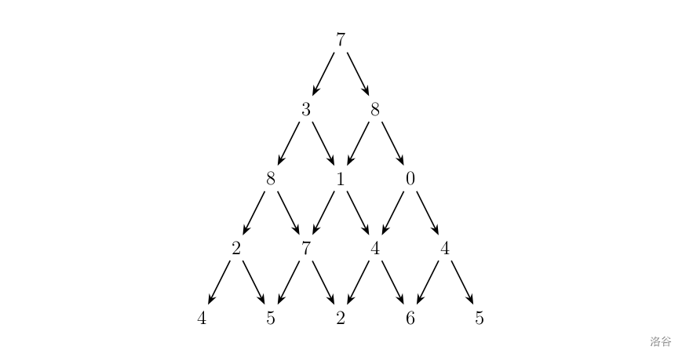

<div align=center >
  <font face="黑体" size=7>动态规划的思考艺术（第二卷）</font>
 </div>

##### 写在前面的话

- 经过第一卷的学习，我们应该已经比较熟悉递归、回溯，现在我们开始接触动态规划。当然，依旧是从简单的、经典的，一些问题入手。

##### DP题目精讲

- 例题B_001：[爬楼梯](https://leetcode.cn/problems/climbing-stairs/description/)

  - 题目描述

    ```
    假设你正在爬楼梯。需要n阶你才能到达楼顶。每次你可以爬1或2个台阶。你有多少种不同的方法可以爬到楼顶呢？
    ```

  - 题目样例

    ```
    输入：n = 2
    输出：2
    解释：有两种方法可以爬到楼顶。
    1. 1 阶 + 1 阶
    2. 2 阶
    ```

  - 题目解析

    ```
    状态的定义：我们定义f(i)表示爬到第i阶台阶的方案数
    状态的转移：
       f(i - 1) + 再一次性爬一个台阶，就爬到了第i阶台阶
       f(i - 2) + 再一次性爬二个台阶，就爬到了第i阶台阶
       f(i - 3) + 再一次性爬三个台阶，就爬到了第i阶台阶，但是题目规定"每次你可以爬 1 或 2 个台阶"，所以这种不行。
    状态的边界：f(1) = 1, f(2) = 2
    ```

    - 状态的转移：$f(i) = f(i - 1) + f(i - 2)$
    - 状态的边界：$f(1) = 1, f(2) = 2$
    - 时间复杂度：$O(N)$
  - 在递推法实现时，状态的边界往往就是最开始需要初始化的一些状态；而在记忆化搜索时，状态的边界往往是最后递归到才赋值。
  
- 代码实现

  - 在动态规划递推法的实现中大概分了两种，一种可以叫做**人人为我**，另一种叫做**我为人人**, 当然都叫做递推法。

  - 我为人人：表示根据$状态i$，可以转移到那些状态去。

    - 一般来说，$状态i$已经确定

  - 人人为我：表示$状态i$，可以由哪些其他状态转移而来。

    - 一般来说，由哪些状态转移而来的这些状态都已确定。这也是一个常见的DP优化技巧，由于这些要转移而来的状态都已确定，常常可以利用一些数据结构优化转移的时间复杂度，从而降低整体的时间复杂度。

    - 哦对了，我们一直没有讲DP的时间复杂度，DP的时间复杂度一般可归纳为：$O(T) = O(状态数) * O(转移数)$，还记得我们第一卷讲的DAG图吗？所有的动态规划，都可以抽象为一张DAG图，状态数就对应图上所有的节点数目，转移数就对应单个节点的出边，所以DP的时间复杂度也等于$O(V + E), V为DAG图上的节点数，E为DAG图上的边数，且每个节点，每条边都只访问一次$

    - 在多数情况下，递推法的时间复杂度是：$状态总数×每个状态的决策个数×决策时间$。如果不同状态的决策个数不同，需具体问题具体分析。

    - <div align=center >
      
      <p> 我为人人 示例图 </p>
    </div>
      
    - <div align=center >
    
        <p> 人人为我 示例图 </p>
        </div>

  - 这两种方法本质是一样的，只是在代码实现层面，有的题目适合**人人为我**写法，有的题目适合**我为人人**写法，当然大多数题目两种写法都可。

  - 下面就以本题目，展示两种写法，加深大家对不同实现的理解。

    ```cpp
    // "人人为我" 写法
    class Solution {
    public:
      static const int N = 45 + 5;
      int dp[N];
      int climbStairs(int n) {
          dp[1] = 1;
          dp[2] = 2;
          for (int i = 3; i <= n; ++i) {
              dp[i] = dp[i - 1] + dp[i - 2];
          }
          return dp[n];
      }
    };
    ```

    ```cpp
    // "我为人人" 写法
    // 状态i 一次性爬一步就到了状态i + 1, 一次性爬二步就到了状态i + 1
    class Solution {
    public:
      static const int N = 45 + 5;
      int dp[N];
      int climbStairs(int n) {
          dp[1] = 1;
          dp[2] = 1;
          for (int i = 1; i <= n; ++i) {
              dp[i + 1] += dp[i];
              dp[i + 2] += dp[i];
          }
          return dp[n];
      }
    };
    ```

  - 在**人人为我**的写法中，$状态i$只与$状态i - 1$和$状态i - 2$有关，所以我们并不需要存放$状态i - 3, i - 4$,..., 这样可以节约大量的内存，只需少量几个变量即可，这就是我们常说的**滚动数组**优化。

      ```cpp
      // "人人为我"的"滚动数组"优化
      class Solution {
      public:
        int climbStairs(int n) {
            if (n == 1) return 1;
            if (n == 2) return 2;
            int i1 = 1, i2 = 2, curi;
            for (int i = 3; i <= n; ++i) {
                curi = i1 + i2;
                i1 = i2;
                i2 = curi;
            }
            return curi;
        }
      };
    ```

  - 上面我们使用的都是动态规划里递推的方法，本题的一个递归方法实现如下

      ```cpp
      class Solution {
      public:
        int climbStairs(int n) {
            if (n == 1) return 1;
            if (n == 2) return 2;
            return climbStairs(n - 1) + climbStairs(n - 2);
        } 
      };
    ```

  - 如果我们把处理过的记录下来，便是记忆化了，本题的一个**记忆化搜索**的实现如下

      ```cpp
      class Solution {
      public:
        static const int N = 45 + 5;
        int dp[N];
        int climbStairs(int n) {
            if (n == 1) return 1;
            if (n == 2) return 2;
            if (dp[n] != 0) return dp[n];
            return dp[n] = climbStairs(n - 1) + climbStairs(n - 2);
        }
      };
    ```

  - 至此，我们通过[爬楼梯](https://leetcode.cn/problems/climbing-stairs/description/)这道例题，讲解了大量的概念，和与之对应的代码实现。希望能更好的帮助初学者。当然基于"人人为我"的递推式，还可以把递推式变形成"矩阵快速幂"，但这已不属于初学者的范畴，不过在后面的"动态规划的优化"的相关章节会陆续讲解这类比较套路的DP优化。

- 例题B_002：[数字三角形 Number Triangles](https://www.luogu.com.cn/problem/P1216)

  - 题目描述

    ```
    观察下面的数字金字塔。写一个程序来查找从最高点到底部任意处结束的路径，使路径经过数字的和最大。每一步可以走到左下方的点也可以到达右下方的点。
    在下面的样例中，从7->3->8->7->5的路径产生了最大权值。
    ```

    <div align=center >
        
        <p> 数字三角形 </p>
    </div>

  - 题目样例

    ```
    // 输入
    第一个行一个正整数r，表示行的数目。
    后面每行为这个数字金字塔特定行包含的整数。
    5
    7
    3 8
    8 1 0
    2 7 4 4
    4 5 2 6 5
    // 输出
    单独的一行,包含那个可能得到的最大的和
    30
    ```

  - 题目解析一

    ```
    状态的定义：f(i, j)表示从顶部出发，走到坐标(i, j)时能获得的最大值
    状态的转移：从当前坐标(i, j)，要么走向左下方，要么走向右下方
    状态的边界：走到数字三角形的边界
    ```

    - 状态的转移
      -  如下，**我为人人**形式的递推
      - $f(i, \ j) \begin{cases} \rightarrow f(i + 1, \ j)，往左下方走\\ \rightarrow f(i + 1, \ j + 1)，往右下方走\end{cases}$
    - 状态的边界
      - $f(1, \ 1) = a[1][1]$
    - 时间复杂度
      - $O(N ^ 2)$
    - 在递推法实现中，状态的边界就是对应状态的初始化，以后不在说明

  - 代码实现

    - 如下，我为人人的递推写法

      ```cpp
      #include <bits/stdc++.h>
      using namespace std;
      
      const int N = 1e3 + 5;
      int r, a[N][N], dp[N][N], ans = 0;
      
      int main() {
        cin >> r;
        for (int i = 1; i <= r; ++i)
          for (int j = 1; j <= i; ++j)
            cin >> a[i][j];
            
        dp[1][1] = a[1][1];
        for (int i = 1; i <= r - 1; ++i) {
          for (int j = 1; j <= i; ++j) {
            dp[i + 1][j] = std::max(dp[i + 1][j], dp[i][j] + a[i + 1][j]);
            dp[i + 1][j + 1] = std::max(dp[i + 1][j + 1], dp[i][j] + a[i + 1][j + 1]);
          }
        }
        for (int j = 1; j <= r; ++j) ans = std::max(ans, dp[r][j]);
        cout << ans << "\n";
        return 0;
      }
      ```

  - 题目解析二

    - 这是第二种写法，状态的定义不变，但是转移形式有所变化
    - 状态的转移
      - 如下，**人人为我**形式的递推
      - $f(i, \ j) \begin{cases} \leftarrow f(i - 1, \ j - 1) \ + \ a[i][j]，从左上方而来\\ \leftarrow f(i - 1, \ j) \ + \ a[i][j]，从右上方而来\end{cases}$
    - 状态的边界
          - $f(1, \ 1) = a[1][1]$
    
  - 代码实现

    - 如下，人人为我的递推写法, 由于$f(i, ...)只由f(i - 1, ...)转移而来，所以可以滚动数组优化$，见下面的实现

      ```cpp
      // 人人为我，无滚动数组优化
      #include <bits/stdc++.h>
      using namespace std;
      
      const int N = 1e3 + 5;
      int r, a[N][N], dp[N][N], ans = 0;
      
      int main() {
        cin >> r;
        for (int i = 1; i <= r; ++i)
          for (int j = 1; j <= i; ++j)
            cin >> a[i][j];
            
        dp[1][1] = a[1][1];
        for (int i = 1; i <= r; ++i) {
          for (int j = 1; j <= i; ++j) {
            dp[i][j] = std::max({dp[i - 1][j] + a[i][j], dp[i - 1][j - 1] + a[i][j]});
          }
        }
        for (int j = 1; j <= r; ++j) ans = std::max(ans, dp[r][j]);
        cout << ans << "\n";
        return 0;
      }
    ```
      
    ```cpp
      // 人人为我，滚动数组优化，注意dp数组第一维的大小是2，状态里全部加上"&"就可以简单的实现滚动数组优化了，这也是如何改写为滚动数组优化的技巧。
      #include <bits/stdc++.h>
      using namespace std;
      
      const int N = 1e3 + 5;
    int r, a[N][N], dp[2][N], ans = 0;
      
    int main() {
        cin >> r;
      for (int i = 1; i <= r; ++i)
          for (int j = 1; j <= i; ++j)
          cin >> a[i][j];
            
      dp[1 & 1][1] = a[1][1];
        for (int i = 1; i <= r; ++i) {
          for (int j = 1; j <= i; ++j) {
            dp[i & 1][j] = std::max({dp[i - 1 & 1][j] + a[i][j], dp[i - 1 & 1][j - 1] + a[i][j]});
          }
        }
        for (int j = 1; j <= r; ++j) ans = std::max(ans, dp[r & 1][j]);
        cout << ans << "\n";
        return 0;
      }
      ```
      
      
  
  - 题目解析三
  
      - 我们知道所有的动态规划都可以抽象成一个有向无环图（即DAG图），有时这个DAG图是显式的，有时是隐式的。
      - **DAG模型**：DAG图上的动态规划如计算最长路、最短路或路径计数问题，由于DAG最长（短）路的特殊性，有两种“对称”的状态定义方式。
        - 状态一：$设f(X)表示从状态X出发的最长路（最短路、方案数...）$，转移时考虑状态X能转移到哪些状态，刷表法（也就是递推法里的我为人人）
        - 状态二：$设f(X)表示以状态X结束的最长路（最短路、方案数...）$，转移时考虑状态X由哪些状态转移而来，填表法（也就是递推法里的人人为我）
        - 状态的定义里一个是起点，一个是终点。
  
  - 代码实现
  
    - DAG模型常常用记忆化搜索的方式实现，由于加了记忆化每个状态节点只会被计算一次，所以时间复杂度也为$O(N ^ 2)$
  
  - 状态的定义：$f(i, \ j)表示以位置(i, \ j)出发能获得的最大路径和$
  
  - 状态的转移：$f(i, \ j) \begin{cases} \rightarrow f(i + 1, \ j)，往左下方走\\ \rightarrow f(i + 1, \ j + 1)，往右下方走\end{cases}$
  
    ```cpp
      #include <bits/stdc++.h>
      using namespace std;
      
      const int N = 1e3 + 5;
      int r, a[N][N], dp[N][N], ans = 0;
      
      // dp[i][j]表示以位置(i, j)出发能获得的最大路径和
      int dfs(int i, int j) {
        if (i == r + 1) return 0;
        if (dp[i][j] != -1) return dp[i][j];
        return dp[i][j] = std::max({dfs(i + 1, j) + a[i][j], dfs(i + 1, j + 1) + a[i][j]});
      }
      
      int main() {
        cin >> r;
        for (int i = 1; i <= r; ++i)
          for (int j = 1; j <= i; ++j)
            cin >> a[i][j];
        
        std::memset(dp, -1, sizeof dp);
        cout << dfs(1, 1) << "\n";
        return 0;
      }
      ```
  
    - 状态的定义：$f(i, \ j)表示以位置(i, \ j)结束能获得的最大路径和$

    - 状态的转移：$f(i, \ j) \begin{cases} \leftarrow f(i - 1, \ j - 1) \ + \ a[i][j]，从左上方而来\\ \leftarrow f(i - 1, \ j) \ + \ a[i][j]，从右上方而来\end{cases}$
  
      ```cpp
      #include <bits/stdc++.h>
      using namespace std;
      
      const int N = 1e3 + 5;
      int r, a[N][N], dp[N][N], ans = 0;
      
      // dp[i][j]表示以位置(i, j)结束能获得的最大路径和
      int dfs(int i, int j) {
        if (i == 0) return 0;
        if (dp[i][j] != -1) return dp[i][j];
        return dp[i][j] = std::max({dfs(i - 1, j - 1) + a[i][j], dfs(i - 1, j) + a[i][j]});
      }
      
      int main() {
        cin >> r;
        for (int i = 1; i <= r; ++i)
          for (int j = 1; j <= i; ++j)
            cin >> a[i][j];
        
        std::memset(dp, -1, sizeof dp);
        for (int j = 1; j <= r; ++j) ans = std::max(ans, dfs(r, j));
        cout << ans << "\n";
        return 0;
      }
      ```
  
  - 总结一下：
    - 状态的定义一：$f(i, \ j)表示以位置(i, \ j)出发能获得的最大路径和$，基于这个状态的定义，有递推法和记忆化搜索两种实现方式
    - 状态的定义二：$f(i, \ j)表示以位置(i, \ j)结束能获得的最大路径和$，基于这个状态的定义，有递推法和记忆化搜索两种实现方式
    - 所以上面一共实现了四份代码，希望大家好好理解。对于这四种实现虽然本质都相同，但是在一些时间复杂度要求更高的题目中，**人人为我**的递推实现中，常常可以优化转移的时间，如**前缀和优化DP、线段树优化DP...**，为啥可以优化转移呢？因为在**人人为我**的DP实现中哪些要依赖的状态都已经计算好了，所以我们可以对已计算好的状态利用一些数据结构等技巧优化转移。
    - 对于后面要讲的DP问题，在时间复杂度可以通过题目的情况下，我就只实现其中一种了，由于个人偏好我常常用记忆化搜索的方式实现。

##### 不要删这行