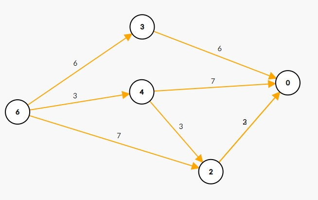

<div align=center >
  <font face="黑体" size=7>动态规划的思考艺术（第三卷）</font>
</div>


##### 写在前面的话

- 这一卷我们开始接触更多的经典模型。
  - 背包问题，最出名的莫过于崔添翼的[背包九讲](https://github.com/OFShare/pack)，建议大家都阅读一下，写的非常棒。
  - 背包问题是最广为人知的动态规划问题之一，拥有很多变形。尽管在理解之后并不难写出程序，但初学者往往需要较多的时间才能掌握它。
  - 一道题通常涉及若干的**观察**（比如某些通用性质？特殊情况？），如果你能有所有的观察，那你就能很大程度上解决它。

##### DP题目精讲

- 例题C_001：[完全背包问题](https://www.luogu.com.cn/problem/U401025)

  - 题目描述

    - 一个容量为$V$公斤的背包。现有$n$种物品,每种物品有**无限多件**,它们的重量分别为$W_i(1≤i≤n)$，它们的价值分别为$C_i(1≤i≤n)$。求能放入背包的最大价值。

    - 输入：第一行:两个整数，$n$(物品数量，$n≤10^3$)和$m$(背包容量，$m≤10^5$)。第$2...n+1$行:每行两个整数$W_i$ , $C_i$，表示每个物品的重量和价值。

      ($1\leq W_i , C_i \le 1000$)

    - 输出：一个数，表示最大价值。

  - 样例

    ```
    // 输入
    3 6
    2 3
    4 7
    3 6
    
    // 输出
    12
    ```

  - 题目解析一

    - 这里先讲一种DAG模型的做法（请看下面的样例DAG带权示意图），我们如果定义下面的状态能否解决这个问题？以及状态的转移的合理性。

    - 状态的定义：$f(u)表示从容量为u的背包出发，的最大值价值$

    - 状态的转移：$f(u) = max\{\ f(u - w) + c, 选择一个重量为w，价值的c的物品\ \}$

    - 为何这样构成DAG图？有点类似在方格图只能向下或向右移动，这里背包装了一个物品后，体积减小后在也回不到原来了，自然构成DAG图。

      <div align=center >
      
      <p> 样例的示例图 </p>
      </div>

    - 时间复杂度：$状态数O(V) * 转移数O(N) = O(N * V)$

      ```cpp
      #include <bits/stdc++.h>
      using namespace std;
      
      int N, V, w[1000 + 5], c[1000 + 5], dp[100000 + 5];
      
      int dfs(int u) {
          if (dp[u] != -1) return dp[u];
          int ret = 0;
          for (int i = 1; i <= N; ++i) {
              if (u >= w[i]) ret = std::max(ret, dfs(u - w[i]) + c[i]); 
          }
          return dp[u] = ret;
      }
      
      int main() {
          cin >> N >> V;
          for (int i = 1; i <= N; ++i) cin >> w[i] >> c[i];
          
          std::memset(dp, -1, sizeof dp);
          cout << dfs(V) << "\n";
          return 0;
      }
      ```

  - 题目解析二

    - 第二种做法，就是正常的完全背包做法。

    - 状态的定义：$f(i，j)表示考虑前i种物品[1:i]，装进容量为j的背包，能获得最大价值$

    - 状态的转移：填表法 $f(i，j) = max\{\ f(i - 1，j)，f(i，j - w[i]) + c[i]，枚举第i个物品选0件或加选一件\ \}$

      - 枚举第$i$种物品选0件好理解，但是如何理解第$i$种物品**加选一件**呢？
      - 我们看$f(i, j - w[i])$的含义，它表示：$考虑前i个物品[1: i]，装进容量为j - w[i]的背包，能获得的最大价值$，此时这个状态隐含了第$i$种物品，选了0件，选了1件，选了2件，...，选了k件时，能获得最大价值，此时再选一件第$i$种物品，就包含了选了1件，选了2件，选了3件，...，选了k + 1件时，能获得的最大价值。这就是为啥叫**加选一件**的含义。
      - 此时上面的转移方程，就做到了，对第$i$件物品，选0件，选1件，选2件，...，选k件时（只要能装的进背包里），能获得的最大价值。

    - 时间复杂度：$状态数O(N * V) * 转移数O(1) = O(N * V)$，如果还是按照上面定义的状态，直接枚举第$i$种物品选$k$件，这样时间复杂度就变为$O(N * V * K)$了。

    - 代码实现，当然$f(i，...)的状态$只依赖$f(i - 1，...)$，自然可以滚动数组优化，由于本题给的内存空间较小，必须滚动数组优化。当然还可以压缩为一维，更进一步减少内存空间，但是这里不推荐这种写法，就不给出代码了。建议大家都写成滚动数组的形式，代码逻辑清晰，方便调试。

      ```cpp
      #include <bits/stdc++.h>
      using namespace std;
      
      // dp[i][j]表示考虑前i种物品[1:i]，装进容量为j的背包，能获得最大价值
      int N, V, w[1000 + 5], c[1000 + 5], dp[2][100000 + 5];
      
      int main() {
          cin >> N >> V;
          for (int i = 1; i <= N; ++i) cin >> w[i] >> c[i];
      
          for (int i = 1; i <= N; ++i) {
              for (int j = 0; j <= V; ++j) {
                  // 第i件物品选0件
                  dp[i & 1][j] = dp[i - 1 & 1][j];
                  // 第i件物品'加选一件'（其实包含了：选1件，选2件，选3件，...）
                  if (j - w[i] >= 0)
                      dp[i & 1][j] = std::max(dp[i & 1][j], dp[i & 1][j - w[i]] + c[i]);
              }
          }
          cout << dp[N & 1][V] << "\n";
          return 0;
      }
      ```

- 例题C_002：[U225269](https://www.luogu.com.cn/problem/U225269)

  - 题目描述

    ```
    有 N 件物品和一个容量是 V 的背包。每件物品只能使用一次。
    
    第 i 件物品的体积是 vi，价值是 wi。
    
    求解将哪些物品装入背包，可使这些物品的总体积不超过背包容量，且总价值最大。 输出最大价值。0<N,V≤1000 0<vi,wi≤1000
    ```

  - 题目样例

    ```
    // 输入
    // 第一行两个整数，V，N，用空格隔开，分别表示背包容积和物品数量。
    // 接下来有 N 行，每行两个整数 vi,wi，用空格隔开，分别表示第 i 件物品的体积和价值。
    5 4
    1 2
    2 4
    3 4
    4 5
    
    // 输出一个整数，表示最大价值。
    8
    ```
    
  - 题目解析

    - 不知大家发现没有，上一题的状态（$f(u)表示从容量为u的背包出发，的最大值价值$），已经不适用了：只凭“剩余体积”这个状态，无法得知每个物品是否已经用过。
    - 换句话说，原来的状态转移太乱了，任何时候都允许使用任何一种物品，难以控制。为了消除这种混乱，需要让状态转移（也就是决策）有序化。适当的增加状态维度
    - 状态的定义：$f(i，j)表示考虑前i种物品[1:i]，装进背包容量为j时（不一定非要装满），的最大价值$
    - 状态的转移：填表法 $f(i，j) = max\{\ f(i - 1，j)，f(i - 1, j- v[i]) + w[i]，对第i种物品选 or 不选\ \}$
    - 时间复杂度：$O(N * V)$
    - 状态的边界：
      - $f(0，0) = f(0，1) = f(0，2) = ... = f(0，j) = 0，装进容量为j的背包，不一定非要装满$
      - $f(0，0) = 0，f(0，1) = f(0，2) = ... = f(0，j) = 状态非法，恰好装满的情况$

  - 代码实现

    - 如下

      ```cpp
      #include <bits/stdc++.h>
      using namespace std;
      
      // dp[i][j]表示考虑前i种物品[1:i]，装进容量为j的背包（不一定非要装满），能获得最大价值
      int V, N, dp[1000 + 5][1000 + 5];
      
      int main() {
          cin >> V >> N;
          for (int i = 1; i <= N; ++i) {
              int v, w;
              cin >> v >> w;
              for (int j = 0; j <= V; ++j) {
                  // 第i种物品不选
                  dp[i][j] = dp[i - 1][j] + 0;
                  // 第i种物品选
                  if (j - v >= 0)
                      dp[i][j] = std::max(dp[i][j], dp[i - 1][j - v] + w);
              }
          }
          cout << dp[N][V] << "\n";
          return 0;
      }
      ```

- 例题C_003：[多重背包问题](https://www.luogu.com.cn/problem/U280382)

  - 题目描述

    ```
    有 N 种物品和一个容量是 V 的背包。
    
    第 i 种物品最多有 si 件，每件体积是 vi ，价值是 wi 。
    
    求解将哪些物品装入背包，可使物品体积总和不超过背包容量，且价值总和最大。 输出最大价值。0<N,V≤100, 0<vi,wi,si≤100
    ```

  - 题目样例

    ```
    // 输入
    // 第一行两个整数，N，V ，用空格隔开，分别表示物品种数和背包容积。
    // 接下来有 N 行，每行三个整数 vi,wi,si ，用空格隔开，分别表示第 i 种物品的体积、价值和数量。
    4 5
    1 2 3
    2 4 1
    3 4 3
    4 5 2
    
    // 输出
    10
    ```

  - 题目解析一

    - 01背包问题中，在转移时我们只需考虑对第$i$种物品选$0，1$件，同理这里我们只需考虑对第$i$种物品选$0，1，2，...，si$件，当然选这么多件的前提是能装的进去。
    
    - 状态的定义：和01背包一摸一样 $f(i，j)表示考虑前i种物品[1:i]，装进背包容量为j时（不一定非要装满），的最大价值$
    
    - 状态的转移：填表法，有所区别  $f(i，j) = max\{\ f(i - 1，j - k * v[i]) + k * w[i]，对第i种物品选k件，k = {0，1，2，...，s[i]}\ \}$
    
    - 时间复杂度：$O(N * V * K)$
    
    - 代码如下
    
      ```cpp
      #include <bits/stdc++.h>
      using namespace std;
      
      // dp[i][j]表示考虑前i种物品[1:i]，装进背包容量为j时（不一定非要装满），的最大价值
      int N, V, dp[100 + 5][100 + 5];
      
      int main() {
          cin >> N >> V;
          for (int i = 1; i <= N; ++i) {
              int v, w, s;
              cin >> v >> w >> s;
              for (int j = 0; j <= V; ++j) {
                  // 第i种物品选0件
                  dp[i][j] = dp[i - 1][j];
                  // 第i种物品选1，2，3，...，件
                  for (int k = 1; k <= s; ++k) {
                      if (j - k * v >= 0)
                         dp[i][j] = std::max(dp[i][j], dp[i - 1][j - k * v] + k * w);
                      else
                          break;
                  }
              }   
          }
          cout << dp[N][V] << "\n";
          return 0;
      }
      ```
    
  - 题目解析二

    - 当我们枚举第$i$件物品，选$0，1，2，3，...，si$件时，真的需要$for (k = 0; k <= si; ++k)$吗？

      - 比如说$si = 9$，那么$1，2，4，2$这四位数就足够了
      - 比如说$si=10$，那么$1，2，4，3$这四位就足够了
      - 比如说$si=38$，那么$1，2，4，8，16，7$这六位就足够了
      - 发现了吗？任何数字$si$，都可以分解为$1，2，4，8，16，32，64，...，$ + $X$，这个$X$是凑出来的。经过这样的分解，我们枚举第$i$件物品的时间复杂度就从$O(si)$ 降为 $O(log\ si)$，这就是我们常说的多重背包的二进制分解

    - 代码实现如下，滚动数组实现，注意代码里的$cur$，时间复杂度$O(N * V * log K)，k = max\{\ s[i] \ \}$

      ```cpp
      #include <bits/stdc++.h>
      using namespace std;
      
      // dp[i][j]表示考虑前i种物品[1:i]，装进背包容量为j时（不一定非要装满），的最大价值
      // cur始终指向当前考虑到了第几件物品，由于会拆分，cur并不等于i哟
      int N, V, dp[2][20000 + 5], cur = 0;
      
      int main() {
          cin >> N >> V;
          for (int i = 1; i <= N; ++i) {
              int v, w, s;
              cin >> v >> w >> s;
      
              // 二进制分解s
              int pre_sum = 0, b = 1;
              while (pre_sum + b <= s) {
                  cur += 1;
      
                  // 拆出b件
                  for (int j = 0; j <= V; ++j) {
                      // 不选
                      dp[cur & 1][j] = dp[cur - 1 & 1][j];
                      // 选
                      if (j - v * b >= 0)
                          dp[cur & 1][j] = std::max(dp[cur & 1][j], dp[cur - 1 & 1][j - v * b] + w * b);
                  }
      
                  pre_sum += b;
                  b *= 2;
              }
      
              int x = s - pre_sum;
              cur += 1;
              // 拆出x件
              for (int j = 0; j <= V; ++j) {
                  // 不选
                  dp[cur & 1][j] = dp[cur - 1 & 1][j];
                  // 选
                  if (j - v * x >= 0)
                      dp[cur & 1][j] = std::max(dp[cur & 1][j], dp[cur - 1 & 1][j - v * x] + w * x);
              }
          }
          cout << dp[cur & 1][V] << "\n";
          return 0;
      }
      ```

- 例题C_004：[零钱兑换](https://leetcode.cn/problems/coin-change/)

  - 题目描述

    ```
    给你一个整数数组 coins，表示不同面额的硬币；以及一个整数 amount ，表示总金额。
    
    计算并返回可以凑成总金额所需的 最少的硬币个数 。如果没有任何一种硬币组合能组成总金额，返回 -1 。
    
    你可以认为每种硬币的数量是无限的。
    
    1 <= coins.length <= 12
    1 <= coins[i] <= 2^31 - 1
    0 <= amount <= 10^4
    ```

  - 题目样例

    ```
    输入：coins = [1, 2, 5], amount = 11
    输出：3 
    解释：11 = 5 + 5 + 1
    ```

  - 题目解析

    - 由于每种硬币的数量是无限的，自然联想到完全背包问题

    - 代码实现如下，时间复杂度$O(N * V)$

      ```cpp
      class Solution {
      public:
          static const int N = 1e4 + 5, INF = 1e9;
          int dp[N];
          // dp[u]表示从总金额为u出发，所需的最少的硬币个数
          int dfs(int u, const vector<int> &coins) {
              if (u == 0) return 0;
              if (dp[u] != -1) return dp[u];
              int ret = INF;
              for (auto &c: coins) {
                  if (u >= c) ret = std::min(ret, dfs(u - c, coins) + 1);
              }
              return dp[u] = ret;
          }
          int coinChange(vector<int>& coins, int amount) {
              std::memset(dp, -1, sizeof dp);
              int ans = dfs(amount, coins);
              if (ans >= INF) return -1;
              return ans;
          }
      };
      ```

- 例题C_005：[零钱兑换 II](https://leetcode.cn/problems/coin-change-ii/)  

  - 题目描述

    ```
    给你一个整数数组 coins 表示不同面额的硬币，另给一个整数 amount 表示总金额。
    
    请你计算并返回可以凑成总金额的硬币组合数。如果任何硬币组合都无法凑出总金额，返回 0 。
    
    假设每一种面额的硬币有无限个。 
    
    题目数据保证结果符合 32 位带符号整数。
    
    1 <= coins.length <= 300
    1 <= coins[i] <= 5000, coins 中的所有值 互不相同
    0 <= amount <= 5000
    ```

  - 题目样例

    ```
    输入：amount = 5, coins = [1, 2, 5]
    输出：4
    解释：有四种方式可以凑成总金额：
    5=5
    5=2+2+1
    5=2+1+1+1
    5=1+1+1+1+1
    ```

  - 题目解析

    - 如果我们依旧按照上一题的解法定义状态，$dp[u]表示从总金额为u出发，可以凑成总金额为u的硬币组合数$，会发现不可做。这里为啥不可做的原因是，在拼凑成金额为u的组合数里，缺少了有序性。我们可以扩展目前的状态定义为，$dp[i][j]表示前i个物品[0:i]，恰好凑成面额为j的金额时，的方案数$。这里的前i个物品，这一维所扩展的状态的就暗示了有序性，我们是一种硬币一种硬币逐渐考虑的。

    - 代码实现如下，时间复杂度$O(N * V)$

      ```cpp
      class Solution {
      public:
          // 完全背包：dp[i][j]表示前i个物品[0:i]，恰好凑成面额为j的金额时，的方案数
          int change(int amount, vector<int>& coins) {
              int n = coins.size();
              vector<int> dp(amount + 5, 0);
              dp[0] = 1;
      
              for (int i = 0; i < n; ++i) {
                  vector<int> new_dp = dp;
                  for (int j = 0; j <= amount; ++j) {
                      // 第i个物品选0件
                      new_dp[j] = dp[j];
                      // 第i个物品'加选'1件
                      if (j - coins[i] >= 0)
                          new_dp[j] += new_dp[j - coins[i]];
                  }
                  dp = std::move(new_dp);
              }
              return dp[amount];
          }
      };
      ```

- 例题C_006：[完全平方数](https://leetcode.cn/problems/perfect-squares/)

  - 题目描述

    ```
    给你一个整数n ，返回和为 n 的完全平方数的最少数量 。
    
    完全平方数 是一个整数，其值等于另一个整数的平方；换句话说，其值等于一个整数自乘的积。例如，1、4、9 和 16 都是完全平方数，而 3 和 11 不是。
    
    1 <= n <= 10^4
    ```

  - 题目样例

    ```
    输入：n = 12
    输出：3 
    解释：12 = 4 + 4 + 4
    ```

  - 题目解析

    - 我们可以先预处理有哪些可以选的数，显然最多$\sqrt{n}$个元素

    - 问题就转化为完全背包问题，且可以很容易的用DAG模型求解

    - 代码如下，时间复杂度$O(N * V) = O(\sqrt{n} * n)$

      ```cpp
      class Solution {
      public:
          static const int N = 1e4 + 5, INF = 1e9;
          int dp[N];
          // dp[u]从整数u出发，恰好凑成u的，最少数量
          int dfs(int u, const vector<int> &coins) {
              if (u == 0) return 0;
              if (dp[u] != -1) return dp[u];
      
              int ret = INF;
              for (auto &c: coins) {
                  if (u >= c) ret = std::min(ret, dfs(u - c, coins) + 1);
              }
              return dp[u] = ret;
          }
          int numSquares(int n) {
              vector<int> coins;
              for (int i = 1; 1LL * i * i <= n; ++i) {
                  coins.push_back(i * i);
              }
              std::memset(dp, -1, sizeof dp);
              int ans = dfs(n, coins);
              return ans >= INF? 0: ans;
          }
      };
      ```

- 例题C_007：[四方定理](https://www.luogu.com.cn/problem/P1586)

  - 题目描述

    四方定理是众所周知的：任意一个正整数$n$，可以分解为不超过四个整数的平方和。例如：$25=1^{2}+2^{2}+2^{2}+4^{2}$，当然还有其他的分解方案，$25=4^{2}+3^{2}$和$25=5^{2}$。给定的正整数$n$，编程统计它能分解的方案总数。注意：$25=4^{2}+3^{2}$和$25=3^{2}+4^{2}$视为一种方案。

  - 题目样例

    第一行为正整数$t$($t\le 100$)，接下来$t$行，每行一个正整数$n$($n\le 32768$)。

    对于每个正整数$n$，输出方案总数。

    ```1
    // 输入
    1
    2003
    
    // 输出
    48
    ```

  - 题目解析
    - 本题和上一题类似，先预处理有哪些可以选的数，显然最多$\sqrt{n}$个元素。

    - 题目描述中，涉及$不超过四个整数$，$25=4^{2}+3^{2}$和$25=3^{2}+4^{2}$视为一种方案（有序性）

    - 我们如下定义状态：$dp[i][j][k]表示前i个元素[1: i]，凑成和为j，且一共选出来k个元素的，方案数.$

    - 代码如下，DP处理的时间复杂度$O(\sqrt{n} * n * 4 * 4)$

      - 由于时间卡的紧，代码使用了$滚动数组$的技巧
      - 对于$t$组数据，由于我们预处理了所有情况，所以每次查询都是$O(1)$

      ```cpp
      #include <bits/stdc++.h>
      using namespace std;
      
      const int N = 32768 + 5;
      int t, n;
      vector<int> nums;
      
      // 25 = 4^2 + 3^2和25 = 3^2 + 4^2表示同一种方案，所以我们可以规定选出的数是不下降排列的。
      // 由于nums数组本身是不下降的，所以下面的DP自然就符合"选出的数是不下降排列的"。
      
      // dp[i][j][k]表示前i个元素[1: i], 凑成和为j，且一共选出来k个元素的，方案数.
      int dp[2][N][5];
      
      int main() {
        nums.push_back(-1);
        // 预处理<=N范围内的所有i * i
        for (int i = 1; 1LL * i * i <= N; ++i) nums.push_back(i * i);
        int len = nums.size() - 1;
      
        // DP  
        dp[0 & 1][0][0] = 1;
        for (int i = 1; i <= len; ++i) {
          for (int j = 0; j < N; ++j) {
            for (int k = 0; k <= 4; ++k) {
              // 枚举第i个元素，nums[i]使用几个
              int d = nums[i];
              // 必须重置为0
              dp[i & 1][j][k] = 0;
              for (int cnt = 0; cnt <= k; ++cnt) {
                if (j - cnt * d >= 0)
                  dp[i & 1][j][k] += dp[i - 1 & 1][j - cnt * d][k - cnt];
              }
            }
          }
        }
        
        cin >> t;
        while (t--) {
          cin >> n;
          cout << dp[len & 1][n][1] + dp[len & 1][n][2] + dp[len & 1][n][3] + dp[len & 1][n][4] << "\n";
        }
        return 0;
      }
      ```

- 例题C_008：[数位成本和为目标值的最大数字](https://leetcode.cn/problems/form-largest-integer-with-digits-that-add-up-to-target/)

  - 题目描述

    ```
    给你一个整数数组 cost 和一个整数 target 。请你返回满足如下规则可以得到的 最大 整数：
    
    给当前结果添加一个数位（i + 1）的成本为 cost[i] （cost 数组下标从 0 开始）。
    总成本必须恰好等于 target 。
    添加的数位中没有数字 0 。
    
    由于答案可能会很大，请你以字符串形式返回。
    如果按照上述要求无法得到任何整数，请你返回 "0" 。
    
    cost.length == 9
    1 <= cost[i] <= 5000
    1 <= target <= 5000
    ```

  - 题目样例

    ```
    输入：cost = [4,3,2,5,6,7,2,5,5], target = 9
    输出："7772"
    解释：添加数位 '7' 的成本为 2 ，添加数位 '2' 的成本为 3 。所以 "7772" 的代价为 2*3+ 3*1 = 9 。 "977" 也是满足要求的数字，但 "7772" 是较大的数字。
     数字     成本
      1  ->   4
      2  ->   3
      3  ->   2
      4  ->   5
      5  ->   6
      6  ->   7
      7  ->   2
      8  ->   5
      9  ->   5
    ```

  -  题目解析

    - 每个数字${1...9}$都有无限个，且都有一个成本，求恰好拼凑成target时，最大的数字。

    - 由于要求最大的数字，我们可能想用DP求出，恰好拼凑成target时，最长的位数。因为对于一个数字，位数越长其值就越大。

    - 在用DP求出最长的位数后，我们贪心的较大的数从高位到低位填数

    - 代码实现如下

      ```cpp
      /*
       * 总的做法：要求最大数字，先转换为数位最长的长度（完全背包DAG模型），再在长度一样的时候贪心选取较大的高位
       *
       */
      class Solution {
      public:
          static const int N = 5e3 + 5, INF = 1e9;
          int dp[N];
          // dp[u]表示从成本u出发，恰好使用完成本，最多能选的数字个数
          int dfs(int u, const vector<int> &cost) {
              if (u == 0) return 0;
              if (dp[u] != -1) return dp[u];
      
              int ret = -INF;
              for (auto &c: cost) {
                  if (u >= c) ret = std::max(ret, dfs(u - c, cost) + 1);
              }
              return dp[u] = ret;
          }
      
          // 在长度选取一样的前提下，贪心的选取较大的高位
          string print(int u, const vector<int> &cost) {
              if (u == 0) return "";
              for (int i = 8; i >= 0; --i) {
                  if (u >= cost[i]) {
                      if (dfs(u, cost) == dfs(u - cost[i], cost) + 1) {
                          return std::to_string(i + 1) + print(u - cost[i], cost);
                      }
                  }
              }
              assert(0);
              return "";
          }
          string largestNumber(vector<int>& cost, int target) {
              std::memset(dp, -1, sizeof dp);
              int mx_len = dfs(target, cost);
              if (mx_len <= 0) return "0";
      
              return print(target, cost);
          }
      };
      ```

##### 写在后面的话


